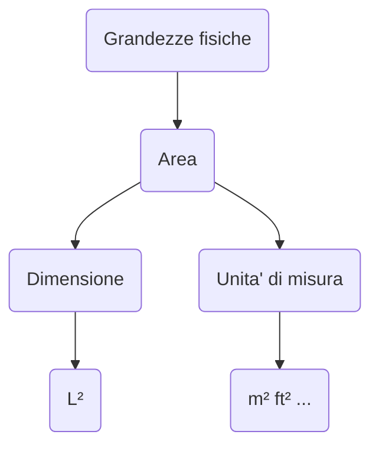

# Grandezze fisiche, dimensioni, e unita' di misura

Una grandezza fisica e' la caratteristica di un oggetto misurabile e.g. la lunghezza di un tavolo.  
Ci sono grandezze fondamentali e derivate, queste si esprimono con una dimensione che puo' essere costituita da una o piu' grandezze fondamentali.  
Ad esempio la dimensione della lunghezza che ' una grandezza fondamentale e' $L$ (lunghezza ovviamente), mentre la dimensione dell'area che e' invece derivata e' $L^2$.

Come si nota in figura le grandezze hanno una ed una sola dimensione, ma possono avere piu' unita' di misura. 

Si puo' usare la notazione $[...]$ per estrarre l'unita' di misura da una dimesione e.g. $[L] = m$  
Questo equivale a dire che l'unita' di misura della lunghezza e' il *metro*.  
Oppure $[I] = A$ ovvero l'unita' di misura della corrente e' l'*Ampere*.  

# Schemi di montaggio

  

Lo **schema di montaggio** e' uno schema in scala che mostra le connessioni tra i diversi elementi dell'impianto, rispettando le loro posizioni.  

# Circuiti elettrici equivalenti

  

Il **circuito elettrico equivalente** e' invece una rappresentazione semplificata del circuito reale.  
Semplificata perche' non deve essere in scala ne' rispettare le posizioni dei componenti.  

Nel circuito elettrico si devono indicare i punti di collegamento specificando se sono **punti semplici** o **nodi**, le grandezze elettriche fondamentali, e la direzione della corrente convenzionale.  

I **punti semplici** sono punti che collegano due elementi di filo conduttore.  
Sono invece **nodi** se collegano almeno tre elementi di filo conduttore.  

  

Nella figura, $F$ e $B$ sono nodi, tutti gli altri invece sono punti semplici.  

# Pila ideale e pila reale  

  

Un componente come un conduttore o una pila, puo' essere rappresentato ignorando dettagli trascurabili come la resistenza interna, in questo si dice che e' **ideale**.  
Si dice invece **reale** quando si tiene conto di questi dettagli, che rendono il modello molto piu' accurato. La descrizione del componente diventa quindi molto vicina alla realta'.  

 

Se vogliamo che la nostra descrizione del comportamento di una pila sia piu' vicino alla realta' dobbiamo allora tenere conto della sua resistenza interna (vedi $R_s$ in figura).  
Si intuisce quindi che se la pila ha una resistenza interna, allora ci deve essere una caduta di potenziale su quest'ultima.  
Ne consegue che la tensione effettiva in uscita dalla pila $V_{out}$ sara' sempre minore di $V_s$ in dipendenza di $R_s$.  

