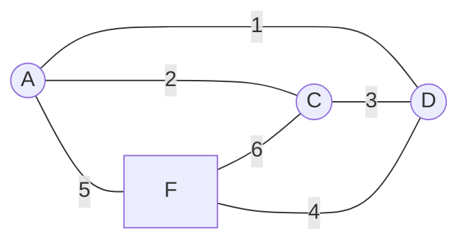

# Vocabolario dei circuiti elettrici  

## Punti di connessione  

I punti di connessione in un circuito possono essere **semplici** o **nodi**.  
Si dicono **semplici** se uniscono **2 componenti**, mentre si dicono **nodi**  
se uniscono **3 o piu' componenti**.    

Nella figura ci sono 5 punti di connessione.  
$A, C, D, F$ sono nodi, mentre $B$ e' un punto di connessione semplice.  

## Rami  

Si dice **ramo** la parte di circuito compresa tra due nodi consecutivi.  
Il circuito in figura ha quindi 6 rami.  

E' importante notare che il numero di rami e' sempre uguale al numero di  
correnti nel circuito $I_1, I_2, I_3, I_4, I_5, I_6$ (vedi circuito in figura).  

## Maglie  

Una maglia e' un insieme di **rami** che costituiscono un **circuito chiuso**.  
Si dice maglia **indipendente** quando non e' composta da altre maglie, ovvero  
non e' scomponibile.  

Esiste una relazione tra il numero di maglie indipendenti, rami e nodi tale che  
$m_{indipendenti}=r-n+1$  

Quindi nel circuito in figura si ha che $6 - 4 + 1 = 3$ ovvero ci sono 3 maglie  
indipendenti.  

## Componenti attivi e passivi  

Si dicono **attivi** i componenti che *forniscono energia elettrica*.  
Si dicono **passivi** i componenti che *assorbono energia elettrica* e la trasformano  
in altre forme di energia (termica, luminosa. meccanica, chimica, etc..).  

Nel circuito in figura ci sono 7 componenti:

* 1 generatore (attivo)
* 6 resistenze (passive)

## Bipolo  

Si dice bipolo un qualunque componente elettrico con due poli, ovvero con due  
punti di connessione.  
Per esempio ci si puo' riferire alla resistenza $R_1$ in figura come a un *bipolo*  
essendo i suoi poli rispettivamente i punti $A$ e $B$.  

