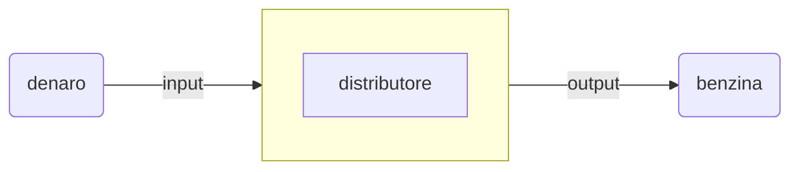
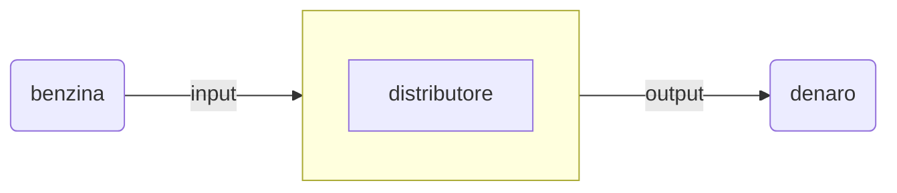

# Funzione di trasferimento  

Un sistema puo e' essere guardato da diversi punti di vista, prendiamo  
per esempio un distributore di benzina.
Dal punto di vista del consumatore il distributore e' un sistema che  
accetta denaro come input, ed eroga benzina come output.  
Dal punto di vista del gestore pero' le cose cambiano.  

## Vista consumatore

## Vista gestore

Si capisce quindi che la descrizione del sistema puo' cambiare a  
seconda del punto da cui lo si osserva.  
Per il momento prendiamo in considerazione solo il punto di vista del  
consumatore.  

$sistema = distributore_{vistaconsumatore}$  

Supponiamo che prezzo il della benzina sia di $2\ \epsilon/\ell$  
Dopo qualche rifornimento si avrebbe questa tabella.  

| $\epsilon$ | $\ell$ | $\epsilon/\ell$ |
| ---------- | ------ | --------------- |
| $5$        | $2.5$  | $\frac{1}{2}$   |
| $10$       | $5$    | $\frac{1}{2}$   |
| $15$       | $7.5$  | $\frac{1}{2}$   |

Il rapporto tra output ed input prende il nome di **funzione di trasferimento**  
e si indica con $F$.  
$F = \frac{y}{x} = \frac{output}{input}$  

Nel nostro esempio abbiamo quindi $F = \frac{\ell}{\epsilon}$  ovvero $\ell = F \cdot \epsilon$  
Dato che $F = \frac{1}{2}$ allora $\frac{1}{2} \cdot \epsilon = \ell$

Il nome **funzione di trasferimento** viene proprio dal fatto che permette  
di trasformare l'input in output.  

$F \cdot input = output$
