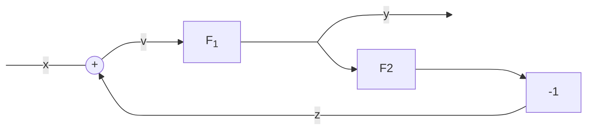
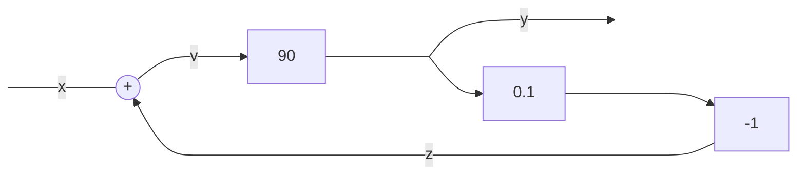

# Retroazione negativa  

Si dice collegamento in retroazione negativa quando parte dell'output viene  
rediretto in input con azione negativa, quindi sottraendosi all'input stesso.  
In pratica si ottiene un effetto di autoregolazione dove l'input causa una  
diminuzione dello stesso.  

Nel diagramma sto esplicitamente includendo il blocco $-1$ ovvero la funzione di  
trasferimento che inverte il segno di $z$.  
L'alternativa e' quella di omettere il blocco e aggiungere invece un segno  
negativo nei pressi del sommatore. 

Per calcolare la funzione di trasferimento di questo sistema dobbiamo prendere  
in considerazione le funzioni di trasferimento note, e le variabili in gioco:  

$y = F_1 \cdot v$  
$z = F_2 \cdot y$  
$v = x - z$  

Questo e' un sistema di equazioni che puo' essere risolto con il metodo della sostituzione.  

$y = F_1 \cdot v = F_1 \cdot (x - z) = F_1 \cdot x - F_1 \cdot z$  
$y = F_1 \cdot x - F_1 \cdot F_2 \cdot y$   
$y + F_1 \cdot F_2 \cdot y= F_1 \cdot x$  
$y \cdot (1 + F_1 \cdot F_2)= F_1 \cdot x$  
$y = \frac{F_1}{1 + F_1 \cdot F_2} \cdot x$  

Abbiamo trovato la funzione di trasferimento di un sistema in retroazione negativa.  

$F_{rn} = \frac{F_1}{1 + F_1 \cdot F_2}$  

## Esempio  

In questo esempio si ha che con $x = 2$ si ottiene $y = 18$  

$F_1 = 90$  
$F_2 = 0.1$  
$F_{rn} = \frac{F_1}{1 + F_1 \cdot F_2} = \frac{90}{1 + 90 + 0.1} = \frac{90}{10} = 9$  
$y = F_{rn} \cdot x = 9 \cdot 2 = 18$  