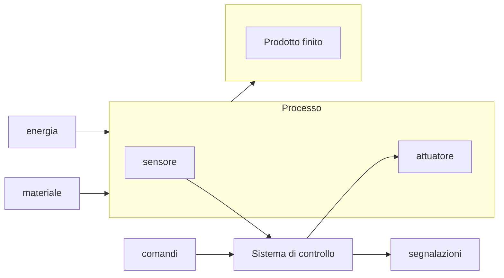

# Sistemi automatici  

Un sistema e' un insieme di elementi interagenti che concorrono a realizzare una certa funzione.  
Un sistema automatico e' quindi un sistema che non ha bisogno di intervento umano, o l'intervento e' comunque parziale.  
C'e' quindi la necessita' di un sistema di controllo e/o di configurazione.  

## Processo   

Il processo rappresenta una serie di operazioni o trasformazioni.  
Esempi di processo sono:

* movimentazione su nastro trasportatore di un carico (nastro valigie aeroporto)
* riscaldamento di una stanza alla temperatura prefissata
* illuminazione di una strada pubblica

## Sensore   

Il sensore e' un qualunque dispositivo in grado di rilevare una grandezza fisica, che verra' poi comunicata al sistema di controllo.  

## Sistema di controllo  

Il sistema di controllo contiene la logica, e prende decisioni in base agli input forniti dai comandi e dai sensori.  
Per questo motivo i sistemi di controllo sono **sempre a bassa tensione** dato che svolgono soltanto operazioni logiche  
non hanno quindi bisogno di molta energia.  
Possono essere **cablati**, **combinatori**, **PLC**, questi verranno affrontati in dettaglio piu avanti.

## Attuatore  

L'attuatore e' un qualunque dispositivo in grado di modificare il processo e.g. una lampada che illumina la strada.  

