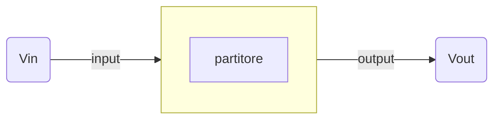

# Partitore di tensione  

Si prenda in considerazione il seguente circuito.  

  

Abbiamo un generatore di tensione a $20V$ e due resistenze rispettivamente di $10\Omega$ e $30\Omega$.  
$E = 20V$  
$R_1 = 30\Omega$  
$R_2 = 10\Omega$  

E' necessario rendersi conto che questo circuito puo' essere visto come un  
sistema dove entra una tensione $V_{in} = 20V$ ed esce una tensione $V_{out} = 5V$.  
La funzione di trasferimento sara' allora $F = \frac{V_{out}}{V_{in}}$ 

Variando la tensione in ingresso possiamo allora ottenere una tabella come segue.  

| $V_{in}$ | $V_{out}$ | $\frac{V_{out}}{V_{in}}$ |
| -------- | --------- | ------------------------ |
| $4$      | $1$       | $\frac{1}{4}$            |
| $6$      | $1.5$     | $\frac{1}{4}$            |
| $20$     | $5$       | $\frac{1}{4}$            |

Si nota immediatamente che esiste una relazione diretta tra $V_{in}$ e $V_{out}$  
la funzione di trasferimento in questo caso allora e' $F = \frac{V_{out}}{V_{in}} = \frac{1}{4}$  
E' possibile pero' derivare la funzione di trasferimento anche senza tabella  
semplicemente riarrangiando i termini di un equazione ormai nota:  
$V_{out} = R_2 \cdot I$  

La tensione in uscita, ovvero la caduta di potenziale su $R_2$ e' uguale a $R_2 \cdot I$  
Ma sappiamo che la corrente $I$ e' uguale a $\frac{E}{R_{tot}}$ dove $R_{tot} = R_1 + R_2$  

Possiamo quindi riscrivere $V_{out} = R_2 \cdot \frac{E}{R_1 + R_2}$  

Adesso ricordiamoci che $R_2 \cdot \frac{E}{R_1 + R_2} = \frac{R_2}{R_1 + R_2} \cdot E$  
ed anche che $E = V_{in}$ allora si ha che...

$V_{out} = \frac{R_2}{R_1 + R_2} \cdot V_{in}$  

E' chiaro adesso che la funzione di trasferiemento e' quindi $F = \frac{R_2}{R_1 + R_2} = \frac{V_{out}}{V_{in}}$  
Abbiamo appena derivato la funzione di trasferimento del partitore di tensione  
che come si puo' intuire non fa altro che ridurre la tensione di un fattore $F$.
