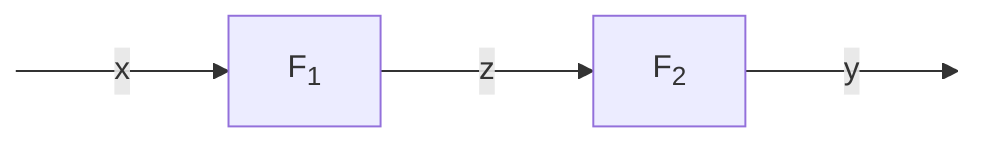
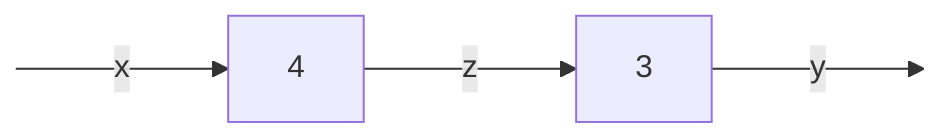
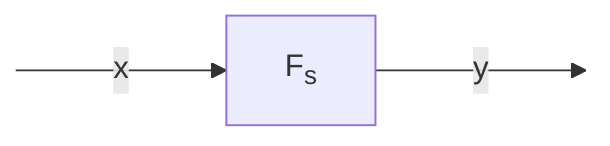
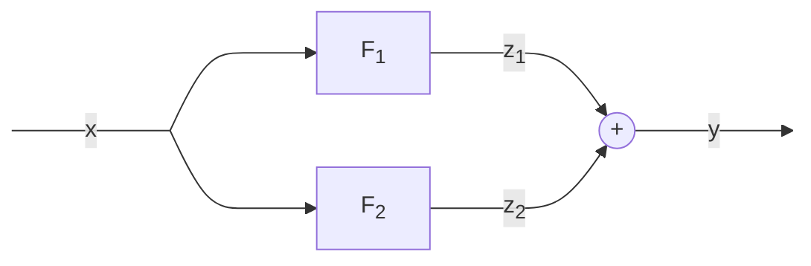
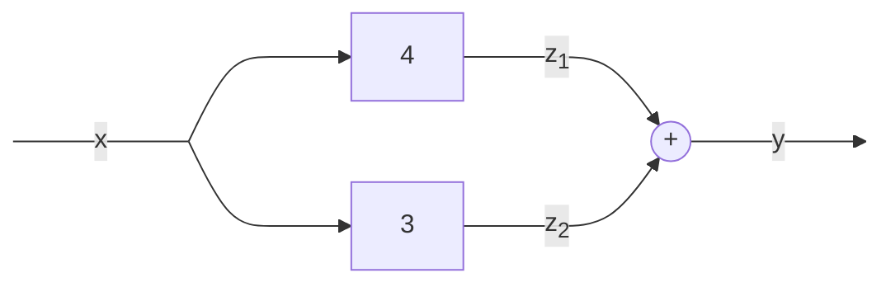
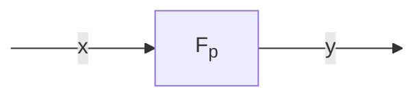

# Sistemi in serie  

Come si vede nel diagramma e' possibile collegare due sistemi in serie (o in cascata).  
Si dice appunto che sono collegati in serie quando l'output di un sistema e' l'input di un altro.  

Vediamo cosa succede alla variabile di uscita con un esempio pratico ponendo $F_1 = 4,\ F_2 = 3$  

Adesso non ci resta che calcolare $y$ per qualche valore arbitrario di $x$  

| $x$ | $z$  | $y$  | $\frac{y}{x}$ |
| --- | ---- | ---- | ------------- |
| $0$ | $0$  | $0$  | x             |
| $1$ | $4$  | $12$ | $12$          |
| $2$ | $8$  | $24$ | $12$          |
| $3$ | $12$ | $36$ | $12$          |

Si nota immediatamente che $F_{serie} = 12$ ma questo e' un risultato che e'  
possibile ottenere semplicemente riarrangiando le funzioni di trasferimento note.  

$z = F_1 \cdot x$  
$y = F_2 \cdot z$  
$y = F_2 \cdot F_1 \cdot x$  
$F_{serie} = F_1 \cdot F_2$  

Nel nostro caso quindi $F_{serie} = F_1 \cdot F_2 = 4 \cdot 3 = 12$ e possiamo allora se vogliamo  
riscrivere il diagramma con la singola funzione di trasferimento serie.

# Sistemi in parallelo  

Il medesimo ragionamento vale per i sistemi collegati in parallelo.  
Si dice che sono collegati in parallelo quando hanno lo stesso ingresso, mentre  
le loro uscite si sommano algebricamente per deternimare l'uscita risultante.  

Di nuovo, riarrangiando le equazioni note si ottiene che la funzione di trasferimento  
di due sistemi in parallelo non e' altro che la somma delle singole funzioni di trasferimento.  

$z_1 = F_1 \cdot x$  
$z_2 = F_2 \cdot x$  
$y = z_1 + z_2$  
$y = F_1 \cdot x + F_2 \cdot x$  
$y = (F_1 + F_2) \cdot x$  
$F_{parallelo} = F_1 + F_2$  

Allora ponendo come nell' esempio precedente $F_1 = 4, F_2 = 3$ si avrebbe un   
diagramma come segue.  

| $x$ | $z_1$ | $z_2$ | $y$  | $\frac{y}{x}$ |
| --- | ----- | ----- | ---- | ------------- |
| $0$ | $0$   | $0$   | $0$  | x             |
| $1$ | $4$   | $3$   | $7$  | $7$           |
| $2$ | $8$   | $6$   | $14$ | $7$           |
| $3$ | $12$  | $9$   | $21$ | $7$           |

Nel nostro caso quindi $F_{parallelo} = F_1 + F_2 = 4 + 3 = 7$ e possiamo allora se  
vogliamo, riscrivere il diagramma con la singola funzione di trasferimento parallelo.

