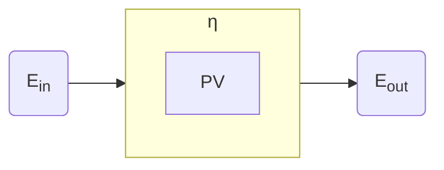

# Stima del fabbisogno energetico  

Il fabbisogno energetico e' il dato piu' difficile da stimare e anche quello piu' importante in quanto puo' portare al sovradimensionamento, ritrovandosi quindi con un impianto costoso che non viene sfruttato a pieno, oppure ad un impianto sottodimensionato che non riesce a soddisfare il bisogno energetico. Si vuole quindi idealmente trovare un equilibrio che permetta di soddisfare il bisogno con il minimo mezzo possibile.  

Per stimare il fabbisogno energetico possiamo procedere in tre modi principali:  

1. energia giornaliera dei dispositivi di utenza
2. energia giornaliera media annua
3. energia giornaliera media mensile

## Dispositivi di utenza  

Questo metodo consiste nel trovare le potenze di tutti i dispositivi, ed il loro tempo di utilizzo medio giornaliero, per poi fare una sommatoria della lora energia applicando infine un fattore di sicurezza.  

| Dispositivo | Potenza$[W]$ | Quantita' | Tempo di utilizzo $[ore\ al\ giorno]$ | Energia $[kWh]$ |
| ----------- | ------------ | --------- | ------------------------------------- | --------------- |
| televisore  | 180          | 1         | 3                                     | 0.54            |
| computer    | 45           | 2         | 4                                     | 0.36            |
| ...         | ...          | ...       | ...                                   | ...             |

Si ha allora che l'energia giornaliera consumata e':  

$E_{g} = 0.54 + 0.36 = 0.9\ kWh$  

A questo valore viene applicato un fattore di sicurezza di $1.22$ nel caso di un impianto **stand-alone** per garantire la ricarica degli accumulatori durante prolungati periodi di annuvolamento.  

$E_c = K \cdot E_g = 1.22 \cdot 0.9 = 1.098\ kWh$  

## Energia giornaliera media annua  

Conoscendo il consumo annuo di energia possiamo semplicemente dividerlo per il numero di giorni in un anno e trovare il consumo di energia giornaliero medio annuale.  

$E_{gma} = \dfrac{2400}{365} = 6.58\ kWh$  

## Energia giornaliera media mensile  

  

Osservando una bolletta si puo' notare che il conumo varia nel tempo, e che si hanno quindi mesi in qui il fabbisogno e' maggiore. Utilizzando il mese con il consumo maggiore per ragioni conservative, si puo' osservare che il fabbisogno di energia non verrebbe soddisfatto dalla stima calcolata precedentemente.  

$E_{gmm} = \dfrac{270}{31} = 8.7\ kWh$  

Questo ci dice che un impianto che produce $6.58\ kWh$ non sarebbe stato sufficiente in luglio.  

## Calcolo del numero di pannelli  

Ora ricordandoci che un pannello puo' essere visto come un convertitore di energia, ovvero $E_{out} = \eta \cdot E_{in}$ possiamo dire che:  

$E_{in} = G \cdot N_{pannelli} \cdot A$  

Se questa e' l'energia in ingresso allora l'energia in uscita dal pannello sara':  

$E_{out} = \eta \cdot E_{in} = \eta \cdot G \cdot N_{pannelli} \cdot A$  

Allora per trovare il numero di pannelli $N$ necessari a soddisfare il fabbisogno massimo di energia giornaliero $E_g = 8.7\ kWh$ ci bastera' conoscere l'irraggiamento medio giornaliero nel caso peggiore, per esempio a dicembre $G_{dic} = 2.18\ kWh/m^2$ utilizzando per esempio strumenti come **ENEA**, o **PVGIS**, ed infine l'area del pannello $A = 2\ m^2$.  

$N = \dfrac{E_g}{\eta \cdot G_{dic} \cdot A} \simeq 14\ pannelli$  

# Radiazione solare  

  

Si fa presente che la radiazione $G$ espressa in $kWh/m^2$ che arriva su un pannello e' la risultante di tre componenti dovute a tre fenomeni fisici diversi.  

$G = I + D + R$  

Dove $G$ e' appunto la radiazione totale, anche detta globale, perche tiene conto di tutti e tre i fenomeni fisici, mentre $I$ e' la **radiazione diretta** dovuta al disco solare, $D$ e' la **radiazione diffusa** dall'atmosfera, mentre $R$ e' invece la **radiazione riflessa**.  