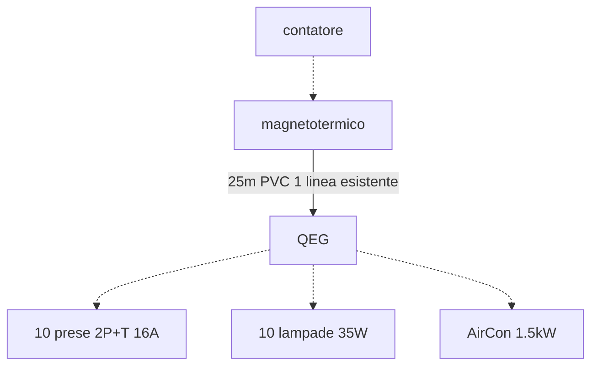

# Esercitazione dimensionamento  

Tenendo conto che siamo all'interno di un ufficio vogliamo determinare:  

1. la potenza convenzionale complessiva
2. la tipologia e sezione della linea di alimentazione del quadro elettrico
3. il magnetotermico differenziale generale (si consideri la resistivita' del suolo $\rho_E = 300\ \Omega m$ e che nel quadro sono presenti differenziali da $30\ mA$)

## Potenza convenzionale  

$P_{prese} = N \cdot V_{n} \cdot I_{max} \cdot \cos \varphi \cdot K_p = 10 \cdot 230 \cdot 16 \cdot 0.9 \cdot 0.1 = 3312\ W$  

$P_{luci} = N \cdot P_n \cdot K_p \cdot K_c = 10 \cdot 35 \cdot 1 \cdot 0.8 = 280\ W$  

$P_{aircon} = \dfrac{P_n}{\eta} \cdot K_u \cdot K_c = \dfrac{1500}{0.9} \cdot 0.8 \cdot 1 = 1333\ W$  
