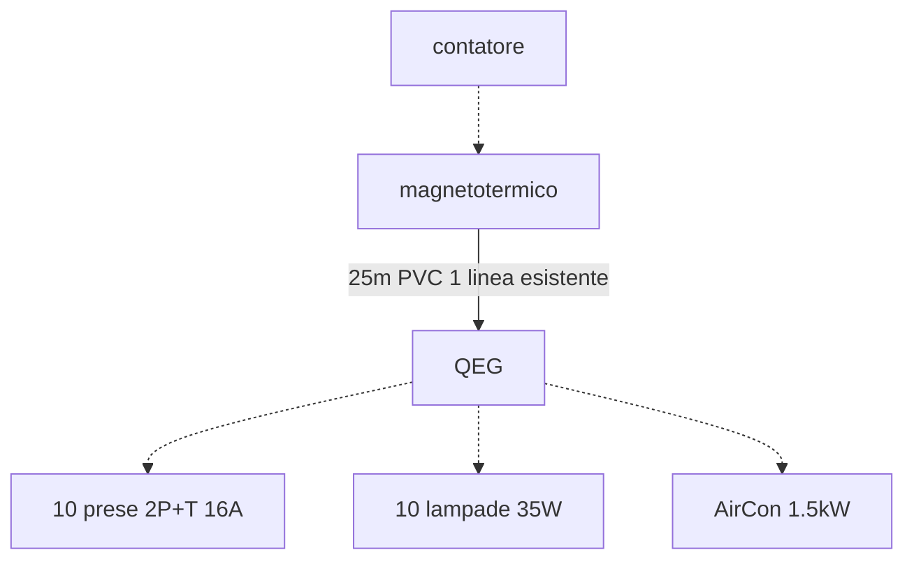

# Esercitazione dimensionamento  

Tenendo conto che siamo all'interno di un ufficio vogliamo determinare:  

1. la potenza convenzionale complessiva
2. la tipologia e sezione della linea di alimentazione del quadro elettrico
3. il magnetotermico differenziale generale (si consideri la resistivita' del suolo $\rho_E = 300\ \Omega m$ e che nel quadro sono presenti differenziali da $30 \mA$)

