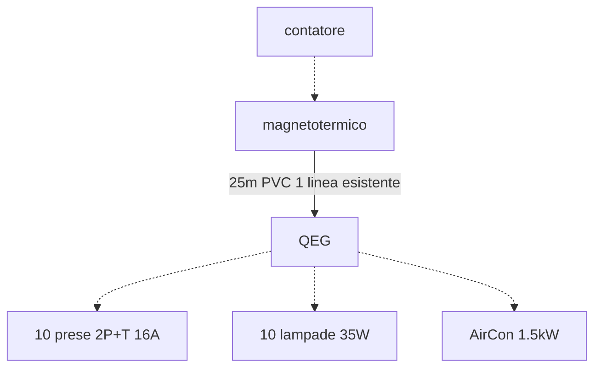

# Esercitazione dimensionamento  

Tenendo conto che siamo all'interno di un ufficio vogliamo determinare:  

1. la potenza convenzionale complessiva
2. la tipologia e sezione della linea di alimentazione del quadro elettrico
3. il magnetotermico differenziale generale (si consideri la resistivita' del suolo $\rho_E = 300\ \Omega m$ e che nel quadro sono presenti differenziali da $30\ mA$)

## Potenza convenzionale e corrente d'impiego  

$P_{prese} = N \cdot V_{n} \cdot I_{max} \cdot \cos \varphi \cdot K_p = 10 \cdot 230 \cdot 16 \cdot 0.9 \cdot 0.1 = 3312\ W$  

$P_{luci} = N \cdot P_n \cdot K_p \cdot K_c = 10 \cdot 35 \cdot 1 \cdot 0.8 = 280\ W$  

$P_{aircon} = \dfrac{P_n}{\eta} \cdot K_u \cdot K_c = \dfrac{1500}{0.9} \cdot 0.8 \cdot 1 \simeq 1333\ W$  

Si ha allora che la potenza convenzionale e':  

$P_c = P_{prese} + P_{luci} + P_{aircon} = 3312 + 280 + 1333 = 4925\ W$  

Troviamo ora la corrente d'impiego.  

$I_b = \dfrac{P_c}{V_n \cdot \cos \varphi} = \dfrac{4925}{230 \cdot 0.9} \simeq 23.8\ A$  

## Dimensionamento linea (portata)  

Sappiamo che la portata $I_z$ deve soddisfare la condizione:  

$I_b \le I_z$  

Considerando la posa **3A** in aria si assumera' una temperatura di $30^\circ$ quindi $K_1 = 1$ ed un $K_2 = 0.8$ che tiene conto di una posa a fascio con una linea esistente. Ipotizzando il caso peggiore dove $I_b = I_z = I_0 \cdot K_1 \cdot K_2$ si ha allora che:  

$I_0 = \dfrac{I_b}{K_1 \cdot K_2} = \dfrac{23.8}{0.8} = 29.75\ A$  

  

Per soddisfare $I_0 \ge 29.75\ A$ si sceglie allora una cavo di sezione $4\ mm^2$ con $I_0 = 30\ A$.  

## Dimensionamento linea (caduta di tensione)  

Decidiamo che per questa linea si puo' avere una caduta di tensione massima del 2% ovvero $4.6\ V$.  

$u = \dfrac{\Delta V \cdot 1000}{I_b \cdot L} = \dfrac{4.6 \cdot 1000}{23.8 \cdot 25} \simeq 7.73\ \frac{mV}{Am}$  

  

Si considera allora la caduta di tensione minore di quella calcolata ovvero $7.19\ \frac{mV}{Am}$ trovando che la sezione di $4\ mm^2$ calcolata in funzione della portata non va bene, ma ci serve invece una sezione di $6\ mm^2$ con una $I_0 = 38\ A$ (vedi tabella) percio' la portata del nostro cavo sara':  

$I_z = I_0 \cdot K_1 \cdot K_2 = 38 \cdot 1 \cdot 0.8 = 30.4\ A$  

## Dimesionamento magnetotermico  

Per utilizzare un solo dispositivo per la protezione da sovraccarico e cortocircuito si devono soddisfare le seguenti condizioni:  

1. che il dispositivo sia posto all'inizio della linea
2. che il potere di interruzione sia maggiore della corrente di cortocircuito
3. che l'energia termica passante sia inferiore a quella sopportabile dal cavo

Sappiamo che la condizione da soddisfare per la protezione da sovraccarico e':  

$I_b \le I_n \le I_z \implies 23.8 \le I_n \le 30.4$  

Sceglieremo allora un magnetotermico con $I_n = 25\ A$ con un potere di interruzione di $6\ kA$ in modo da rispettare la normativa. L'interruttore inoltre dovra' lasciare passare un'energia termica inferiore all'energia termica specifica sopportabile dal cavo.  

$\int_{t_0}^{t_n} i^2dt \le K^2S^2 = 115^2\cdot 6^2 = 4.761 \cdot 10^5\ A^2s$  

## Dimensionamento differenziale  

Per il differenziale si vuole soddisfare la condizione per la protezione contro i contatti indiretti considerando l'ambiente ordinario $U_L = 50\ V$.  

$R_E \cdot I_{dn} \le U_L$  

  

Dobbiamo pero' considerare che a valle abbiamo dei differenziali da $30\ mA$ percio' ci serve un differenziale di almeno $300\ mA = 0.3\ A$. Dovremo allora realizzare l'impianto di terra con un picchetto di lunghezza $3\ m$ e diametro $2\ cm$ per ottenere una resistenza di terra $R_E = 97\ \Omega$.  

  

$I_{dn} \le \dfrac{U_L}{R_E} = \dfrac{50}{97} = 0.515\ A = 515\ mA$  