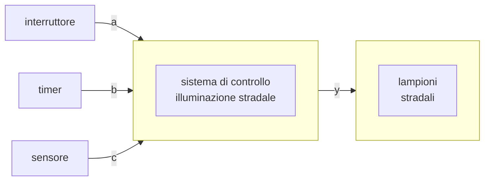

# Grandezze analogiche e digitali  

L'esperienza ci insegna che le grandezze fisiche variano nel tempo assumendo tutti gli infiniti valori osservabili. Queste, chiamate **grandezze analogiche**, sono **variabili continue**, ovvero grandezze che possono variare, dove il passaggio da un valore all'altro avviene con continuita' in relazione ad altre grandezze analoghe e.g. la lunghezza della colonna di mercurio di un termometro che varia al variare della temperatura.  

  

Le **grandezze digitali**, al contrario passano da un valore all'altro in tempi teoricamente nulli. Queste grandezze sono variabili discrete in quanto possono variare, ma possono assumere solo un numero finito di valori compresi in un intervallo.  

# Logica combinatoria  

In circuito logico combinatorio i componenti sono combinati in modo tale che le uscite dipendano in ogni momento soltanto dai suoi ingressi. Questi saranno di numero finito, e produrranno quindi un numero finito di possibilita' predefinite.  

In questo esempio le variabili di ingresso $a,b,c$ cosi' come quella di uscita $y$ sono variabili binarie, ovvero che possono assumere due stati, $0$ e $1$. La combinazione degli stati delle variabili in ingresso determina lo stato di quella in uscita:  

$$
y \begin{cases}
  \begin{aligned}
    0 \implies lampioni\ spenti \\
    1 \implies lampioni\ accesi \\
  \end{aligned}
\end{cases}
$$

| $a$ | $b$ | $c$ | $y$ |
| --- | --- | --- | --- |
| $0$ | $0$ | $0$ | $0$ |
| $0$ | $0$ | $1$ | $1$ |
| $0$ | $1$ | $0$ | $1$ |
| $0$ | $1$ | $1$ | $1$ |
| $1$ | $0$ | $0$ | $1$ |
| $1$ | $0$ | $1$ | $1$ |
| $1$ | $1$ | $0$ | $1$ |
| $1$ | $1$ | $1$ | $1$ |
