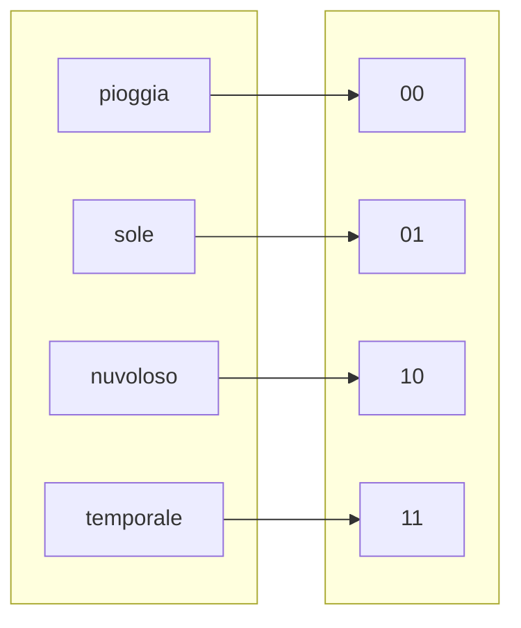

# Codifica binaria  

La codifica binaria consiste nell'associare ad un insieme di eventi, stati, o informazioni, dei numeri binari, o sequenze di bit. Piu' in generale codificare equivale a definire una funzione, ovvero una relazione tra due insiemi.  

Si intuisce allora che con $2$ bit si ottengono $2^2$ combinazioni. Piu' in generale con $n$ bit e' possibile codificare $2^n$ stati/eventi. La motivazione sta dietro al fatto che per esempio con 3 bit si avrebbe $b_2b_1b_0$ ma ognuno di questi bit puo' assumere due valori, 0 o 1. Il numero di combinazioni possibili viene allora identificato da $2^n$ in questo caso $2^3 = 8$  

# ASCII  

La codifica ASCII (American Standard Code for Information Interchange) pubblicata nel 1963 fu uno dei primi standard a definire la codifica dei caratteri. Prevedeva originariamente l'uso di 7 bit, permettendo cosi' la codifica di $2^7 = 128$ caratteri. Fu' poi esteso per supportare diverse lingue e simboli.  
