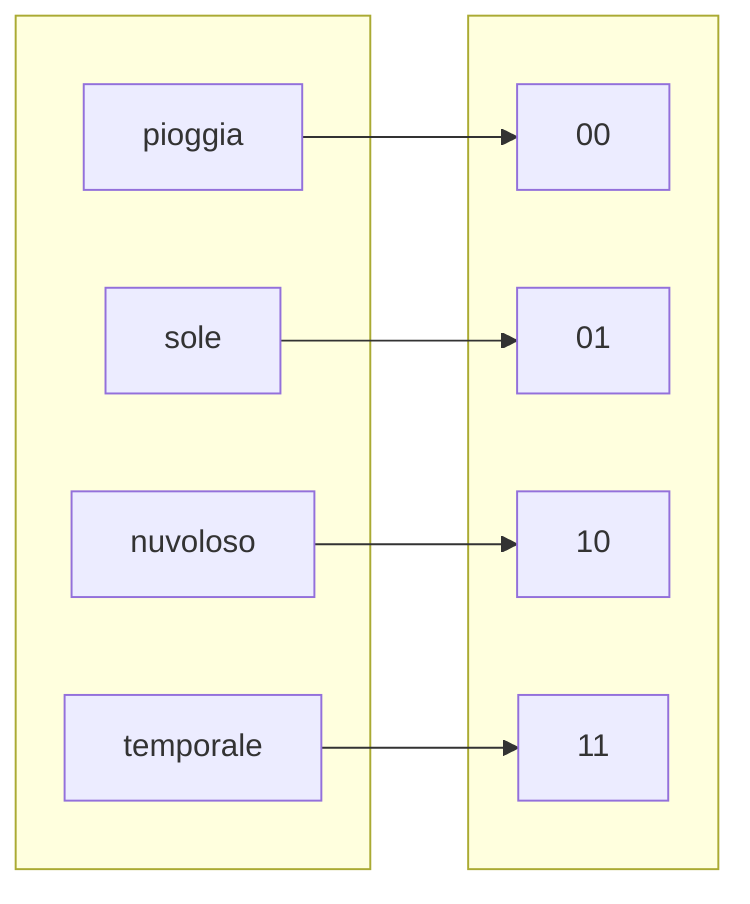
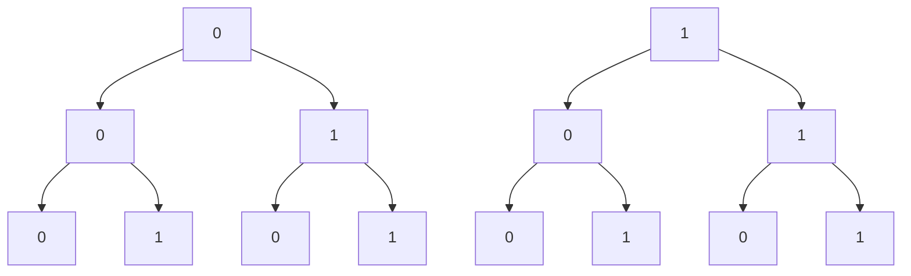

# Codifica binaria  

La codifica binaria consiste nell'associare ad un insieme di eventi, stati, o informazioni, dei numeri binari, o sequenze di bit. Piu' in generale codificare equivale a definire una funzione, ovvero una relazione tra due insiemi.  

Si intuisce allora che con $2$ bit si possono ottenere $2^2$ stati. Piu' in generale con $n$ bit e' possibile codificare $2^n$ stati/eventi. Questa prende il nome di **disposizione con ripetizione**.  

## Disposizioni con ripetizione  

Nelle disposizioni e' importante l'ordine degli elementi, al contrario delle combinazioni e.g. $\lbrace AB, BA \rbrace$ sono due disposizioni che identificano una singola combinazione $\lbrace AB \rbrace$. Le disposizioni con ripetizione ammettono la presenza di elementi uguali nella disposizione e.g. $\lbrace AA \rbrace$. Per calcolare il numero di disposizioni con ripetizione di classe $k$ di $n$ elementi distinti, possiamo utilizzare una tabella.  

| $k_1$ | $k_2$ | $...$ | $k_n$ |
| ----- | ----- | ----- | ----- |
| $n$   | $n$   | $...$ | $n$   |

Nel contesto di una codifica binaria dove ogni bit $k$ puo' assumere $n = 2$ valori $\lbrace 0,1 \rbrace$ ne segue che il numero di disposizioni con ripetizione sia:  

$D_{n, k} = \underbrace{n \cdot n \cdot ... \cdot n}_{k\ volte} = n^k$  

Con 3 bit ad esempio, si avrebbe $b_1b_2b_3$ ma ognuno di questi bit puo' assumere 2 valori, 0 o 1, per cui si ha che il numero di stati possibili equivale a $2^3 = 8$  

# ASCII  

La codifica ASCII (American Standard Code for Information Interchange) pubblicata nel 1963 fu uno dei primi standard a definire la codifica dei caratteri. Prevedeva originariamente l'uso di 7 bit, permettendo cosi' la codifica di $2^7 = 128$ caratteri. Fu' poi esteso per supportare diverse lingue e simboli.  

