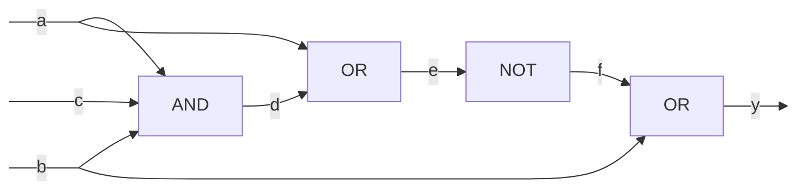

# Rappresentazione circuiti logici  

E' importante rendersi conto che un circuito logico non e' altro che la rappresentazione grafica di una funzione.  

Questo circuito rappresenta quindi una funzione:  

$y = f(a,b,c)$  

Dove $a,b,c$ sono gli input, mentre $y$ e' l'output. Essendo gli input valori binari, possiamo affermare che esistono $2^3 = 8$ distinti input/output come si vede dalla **tabella di verita'**.  

| a   | b   | c   | d   | e   | f   | y   |
| --- | --- | --- | --- | --- | --- | --- |
| 0   | 0   | 0   | 0   | 0   | 1   | 1   |
| 0   | 0   | 1   | 0   | 0   | 1   | 1   |
| 0   | 1   | 0   | 0   | 0   | 1   | 1   |
| 0   | 1   | 1   | 0   | 0   | 1   | 1   |
| 1   | 0   | 0   | 0   | 1   | 0   | 0   |
| 1   | 0   | 1   | 0   | 1   | 0   | 0   |
| 1   | 1   | 0   | 0   | 1   | 0   | 1   |
| 1   | 1   | 1   | 1   | 1   | 0   | 1   |

Un altro modo per rappresentare la funzione e' attraverso una **mappa di Karnaugh**. Questa e' formata da $2^n$ caselle che equivagono al numero di disposizioni con ripetizione in dipendenza del numero di variabili di input.  

| a\bc | 00  | 01  | 11  | 10  |
| ---- | --- | --- | --- | --- |
| 0    | 1   | 1   | 1   | 1   |
| 1    | 0   | 0   | 1   | 1   |
