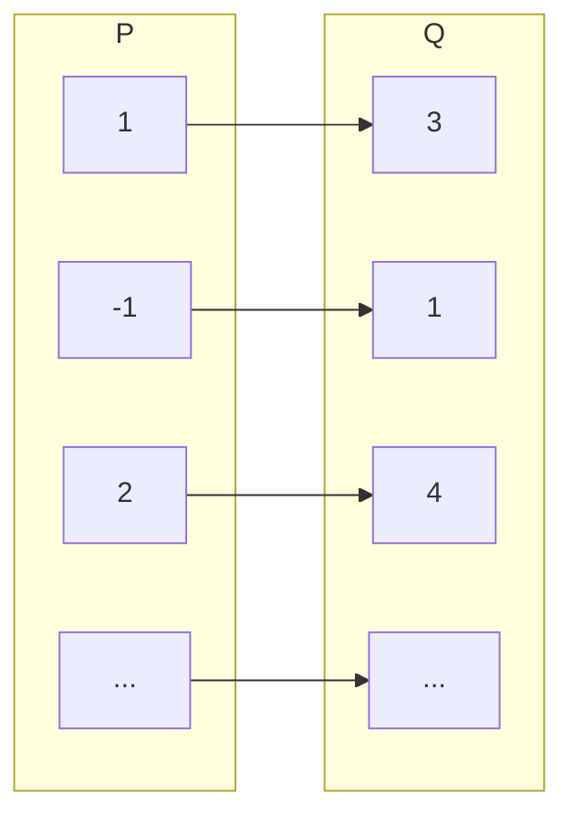
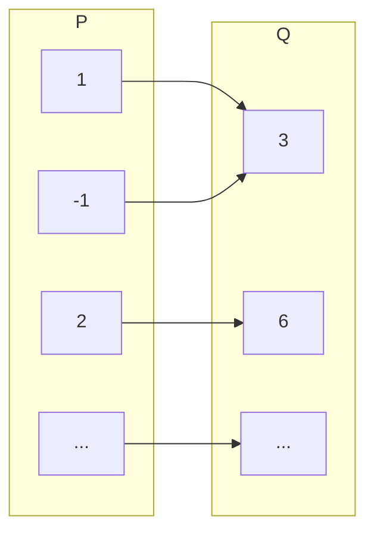

# Definizione di funzione  

Una funzione e' definita come una relazione tra due insiemi senza ambiguita', ovvero $f: P \to Q$ e' una funzione se e solo se ad ogni elemnto di $P$ e' associato uno ed un solo elemento di $Q$. Prendiamo in considerazione il diagramma della funzione $f(x) = x + 2$  

Osservando invece $y = x^2+2$ si nota che esistono piu' elementi di $P$ che portano allo stesso elemento di $Q$, allora per definizione questa non e' una funzione.  

In generale $P$ prende il nome di **dominio**, ovvero il piu' grande sottoinsieme di $\mathbb{R}$ in cui ha senso valutare la funzione. Per esempio con $y = \dfrac{1}{x-5}$ dobbiamo escludere $x = 5$ dal dominio in quanto porterebbe ad una divisione per zero. Si dice invece **immagine** l'insime $Q$ ovvero l'insieme che dei valori che la funzione puo' assumere dato il proprio dominio.  

  

In questo caso ad esempio si hanno due asintoti verticali, per cui il dominio risulta coincidere con una porzione dei reali nelle ascisse $Dom(f) = (-1, 1)$ mentre l'immagine con una porzione dei reali nelle ordinate $Im(f) = [0,+\infty)$  

## Funzione esponenziale  

Con funzione esponenziale si intende una funzione $f(x)$ tale che:  

$y = a^x$  

Per definizione, in modo da descrivere un insieme di funzioni con lo stesso andamento, si dice esponenziale solo e soltanto se:  

$$
f(x) = a^x \ \
\begin{cases}
  \begin{aligned}
    a \gt 0 \\
    a \ne 1
  \end{aligned}
\end{cases}
$$

  

Tracciando il grafico si nota che con $a = 1$ ed $a = 0$ non si ottiene quella che per definizione viene detta funzione ma l'equazione di una retta. Mentre quello che per definizione la funzione esponenziale vuole descrivere e' una crescita (o diminuzione), per cui questi due casi vengono esclusi. Nei casi in cui $a < 0$ si otterebbe invece una funzione discontinua e.g.  

$y = (-4)^x = (-4)^{\frac{1}{2}} = \sqrt{-4} = 2i$  

Percio' anche questo caso viene escluso. E' importante infine notare come ogni esponenziale passi per $y = 1$ quando $x = 0$  

## Asintoti  

  

Dalla definizione di esponenziale si intuisce che $y$ e' sempre crescente o decrescente e non puo' assumere valori negativi, in particolare si ha sempre un asintoto orizzontale, ovvero $y$ raggiunge lo zero solo nel limite.  

> **asintoto** (dal greco *"che non si incontra"*) - La tangente alla curva in un punto all'infinito

$$
a \gt 1 \implies
\begin{cases}
  \begin{aligned}
    \lim_{x \to +\infty} a^x &= +\infty \\
    \lim_{x \to -\infty} a^x &= 0 \\
    \lim_{x \to 0} a^x &= 1
  \end{aligned}
\end{cases}
$$

$$
0 \lt a \lt 1 \implies
\begin{cases}
  \begin{aligned}
    \lim_{x \to +\infty} a^x &= 0 \\
    \lim_{x \to -\infty} a^x &= +\infty \\
    \lim_{x \to 0} a^x &= 1
  \end{aligned}
\end{cases}
$$

## Monotonia  

  

Una funzione si dice monotona quando conserva il suo ordinamento, ovvero quando $x_2 \ge x_1 \implies f(x_2) \ge f(x_1)$ in particolare la funzione esponenziale ha le seguenti proprieta':  

#### monotona crescente  

$x_2 \gt x_1 \implies f(x_2) \gt f(x_1)$  

#### monotona decrescente  

$x_2 \gt x_1 \implies f(x_2) \lt f(x_1)$  
