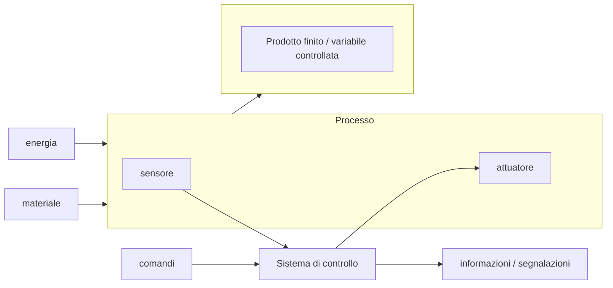

# Automazione industriale  

Nei contesti industriali c'e' bisogno di automatizzare e controllare i processi produttivi attraverso dei sistemi automatici. Ogni sistema automatico e' formato da una parte operativa, ed una parte di comando. La parte operativa contiene **attuatori**, ovvero tutto cio' che modifica il sistema dal punto di vista energetico e.g. motori, pompe, etc. La parte di comando e' il **sistema di controllo**, il quale riceve informazioni da i sensori e in base a queste informazioni agisce sugli attuatori.  

Il sistema di controllo puo' essere realizzato in logica cablata o logica programmata. Per **logica cablata** si intende l'utilizzo di componenti elettromeccanici collegati in modo tale da ottenere la funzione desiderata. Tali sistemi, dato il numero di componenti necessari, possono essere ingombranti, complessi, e quindi poco flessibili in caso di espansioni e/o modifiche. La **logica programmabile** permette invece attraverso appunto dei programmi di poter gestire e modificare tutte le fuzioni di controllo in uno spazio relativamente contenuto. Per questo motivo hanno in gran parte rimpiazzato i sistemi in logica cablata.  

