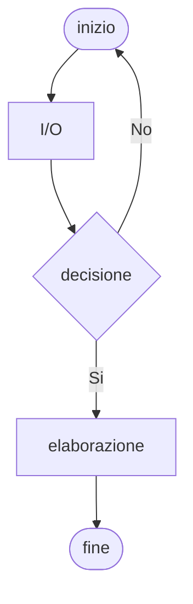
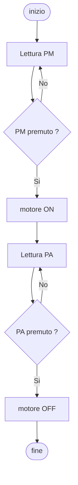

# Diagrammi di flusso  

Un diagramma di flusso, o *flowchart*, e' la rappresentazione grafica di un processo, una sequenza di passi ordinati necessari per compiere un'attivita. I diagrammi piu' semplici fanno uso di 5 blocchi fondamentali, di cui 3 operazionali: decisione, elaborazione, I/O.  

## Condizioni di validita'  

* **blocchi** - i blocchi elaborazione e I/O hanno una sola freccia entrante ed una sola freccia uscente  
* **frecce** - ogni freccia deve entrare in un blocco
* **percorsi** - dal blocco iniziale si deve poter raggiungere ogni blocco, e da ogni blocco si deve poter raggiungere quello finale

## Marcia e arresto motore  

Esempio di processo di marcia e arresto di un motore attraverso un pulsante di marcia PM, ed uno di arresto  PA. Anche se l'esempio sembra violare le condizioni di validita' in quanto nei blochi I/O entra piu' di una freccia.  

