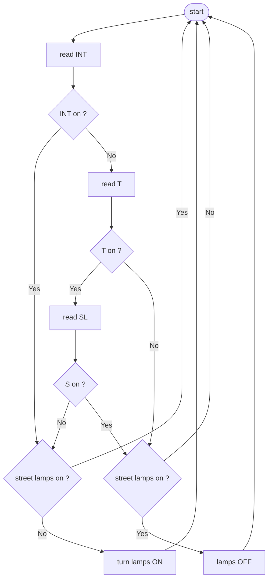

# Illuminazione stradale  

> L'illuminazione avviene mediante l'accensione di lampioni, questa puo' essere fatta manualmente, oppure con un timer ed un sensore di luce

## Identificazione variabili di input  

| nome         | simbolo | tipo    | stati                                                  |
| ------------ | ------- | ------- | ------------------------------------------------------ |
| interruttore | INT     | binario | $$0 \implies aperto \\ 1 \implies chiuso$$             |
| sensore      | SL      | binario | $$0 \implies buio \\ 1 \implies luce$$                 |
| timer        | T       | binario | $$0 \implies\ fuori\ fascia \\ 1 \implies in\ fascia$$ |

