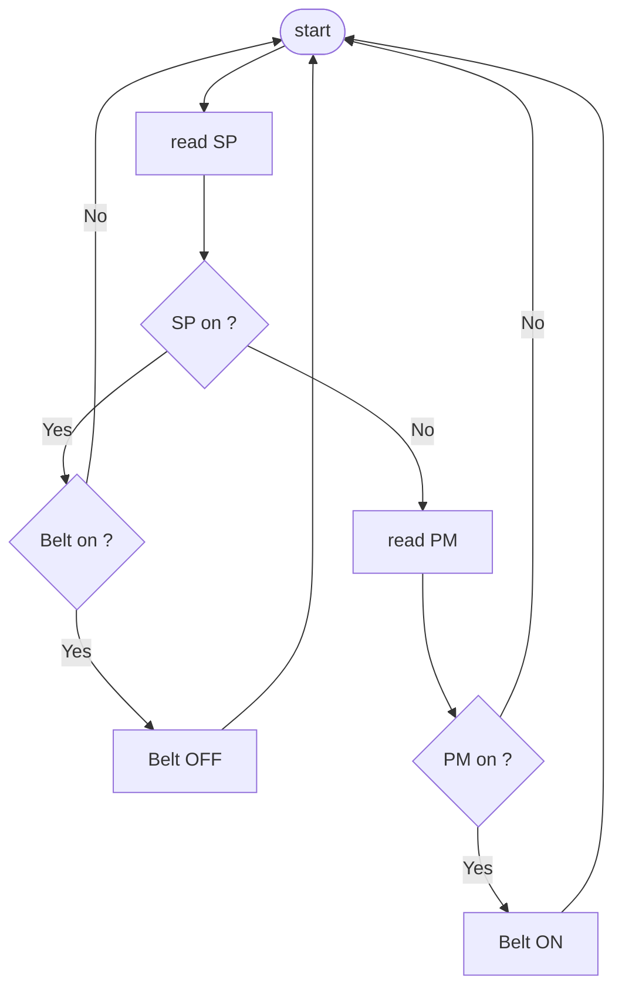

# Nastro trasportatore  

  

> Alla pressione del pulsante di marcia il nastro trasportatore si attiva. Quando l'oggetto raggiunge la fine del nastro, questo deve fermarsi anche se il pulsante di marcia e' premuto.  

## Lista componenti  

| componente        | simbolo | note                                  | stati                             |
| ----------------- | ------- | ------------------------------------- | --------------------------------- |
| pulsante          | PM      | pulsante marcia NO                    | 0/1 - premuto/altrimenti          |
| sensore posizione | SP      | segnala presenza oggetto a fine corsa | 1/0 - oggetto presente/altrimenti |

