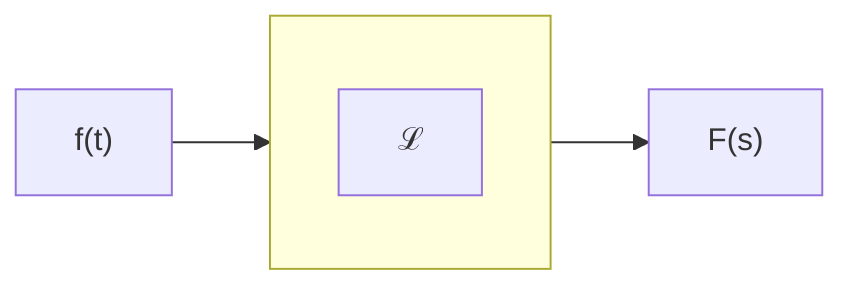
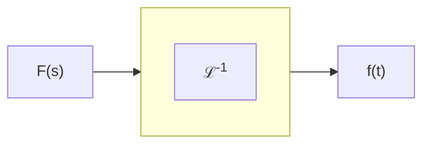

# Introduzione alla trasformata di Laplace  

La trasformata di Laplace $\mathscr{L}$ permette di trasformare funzioni del tempo in espressioni algebriche, cosi' da poter evitare operazioni complesse in cambio di altre piu' semplici. In particolare data in ingresso una funzione del tempo $f(t)$ la **trasformata** presentera' in uscita una funzione $F(s)$ dove $s$ e' una variabile complessa. In generale permette di associare ad una funzione di variabile reale una funzione di variabile complessa.  

Si dice **antitrasformata** il processo inverso, per cui data una funzione $F(s)$ in ingresso, l'antitrasformata presentera' in unscita una funzione del tempo $f(t)$  

### Esempi di trasformate  

| grafico                                                                                                                 | $f(t)$                    | $F(s)$                          |
| ----------------------------------------------------------------------------------------------------------------------- | ------------------------- | ------------------------------- |
|  | $u(t)$                    | $\dfrac{1}{s}$                  |
|       | $e^{-\frac{t}{\tau}}u(t)$ | $\dfrac{1}{s + \frac{1}{\tau}}$ |
|                                                                                                                         | $e^{-at}u(t)$             | $\dfrac{1}{s + a}$              |

Si noti che vale la proporzione di linearita', per cui la somma delle funzioni e' uguale alla somma delle trasformate.  

$f(t) = 3u(t) \implies F(s) = 3 \cdot\dfrac{1}{s} = \dfrac{3}{s}$  

$f(t) = e^{-4t}u(t) \implies F(s) = \dfrac{1}{s + 4}$  

$f(t) = 3u(t) + e^{-4t}u(t) \implies F(s) = \dfrac{3}{s} + \dfrac{1}{s + 4}$  
