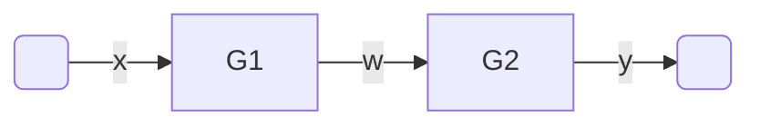
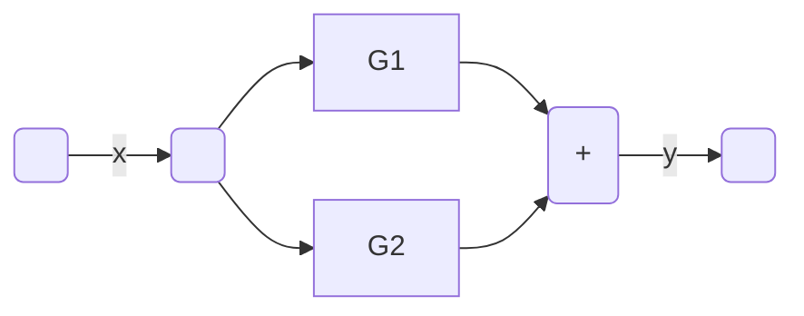
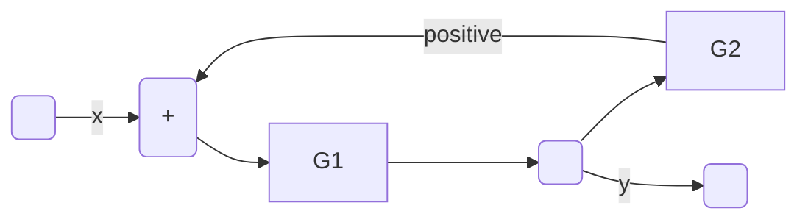
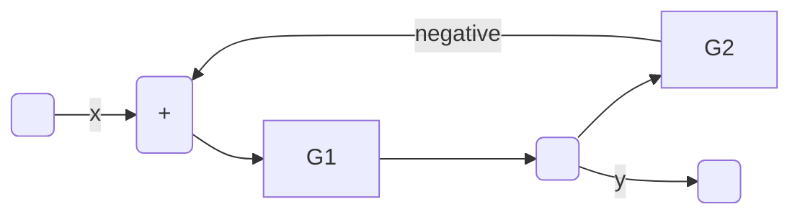

# Ripasso collegamenti  
## Serie  

Nel collegamento serie si ha che $w = G_1x$ per cui...  

$y = G_2w = G_2G_1x$  

La funzione di trasferimento del sistema allora sara':  

$G_{tot} = \dfrac{y}{x} = \dfrac{G_2G_1\cancel{x}}{\cancel{x}} = G_2G_1$  

## Parallelo  

Nel collegamento parallelo la funzione di trasferimento e' invece:  

$G_{tot} = G_1+G_2$  

## Retroazione positiva  

In retroazione positive si ha invece che...  

$G_{tot} =\dfrac{G_1}{1 - G_1G_2}$  

## Retroazione negativa  

In retroazione positive si ha invece che...  

$G_{tot} =\dfrac{G_1}{1 + G_1G_2}$  

