# Intro conversione analogico-digitale  

I segnali analogici misurati dai sensori devono essere vengono standardizzati e convertiti in formato digitale per poter essere correttamente interpretati e processati dai dispositivi di controllo digitali e.g. PLC. Serve allora un dispositivo che esegua la conversione da analogico a digitale, questi vengono chiamati **ADC**, *analog-to-digital converter*.  

```mermaid
flowchart LR
    analog(" ")--"Temperatura"-->transd
    subgraph transd[Trasduttore]
        direction LR
        cond["circuito di<br> condizionamento"]
        sensore-->cond
    end
    transd--"0÷10V / 0÷20mA"-->out(" ")
```

L'uscita del trasduttore viene standardizzata dal **circuito di condizionamento** a $0\div10V$ oppure $0\div20mA$ per cui nel rappresentare ad esempio un range di temperature si avra'...  

| dimension  | min   | max   |
| ---------- | ----- | ----- |
| $T[\circ]$ | $-20$ | $+80$ |
| $V[V]$     | $0$   | $10$  |

L'ADC si occupa quindi di convertire l'ingresso analogico in $n$ uscite in formato digitale, un questo caso si ha un uscita a tre bit $b_2,b_1,b_0$  

La tensione in ingresso $V_T$ sara' $0 \gt V_T \gt V_{Fs}$ dove $V_{Fs}$ e' la tensione massima (fondo scala). Con tre bit e' possibile rappresentare $2^3$ temperature, per cui la risoluzione del convertitore sara'...  

$Q = \dfrac{V_{Fs}}{N}$  

Dove $N = 2^3$ ovvero il numero di stati rappresentabili con i bit a disposizione.  

> La risoluzione e' definita come la minima variazione della grandezza analogica in ingresso che causa una variazione sull'uscita digitale, questa variazione e' chiamata quanto $Q$  

$Q = \dfrac{V_{Fs}}{N} = \dfrac{10}{8} = 1.25\ V$  
