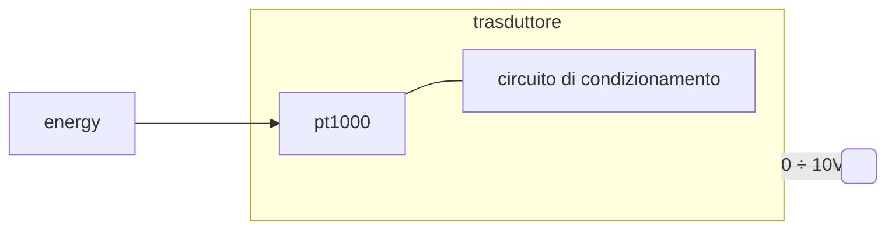

# Dalla grandezza fisica ai bit  

Si vuole esaminare il processo di conversione analogico-digitale partendo da una grandezza fisica come la temperatura. Scegliamo una sonda **PT1000** che sappiamo essere riconducibile ad un resistore di resistenza variable, in questo caso in dipendenza della temperatura.  

## Trasduttore  

  

La sonda dovra' essere inserita in un circuito di condizionamento che servira' per fornire un'interfaccia standard, in particolare $0 \div 10\ V$ in uscita (alternativamente $0 \div 20\ mA$ in corrente).  

  

In figura si puo' dedurre che la temperatura sia $0^\circ$ in quanto la sonda $R_T = 1\ k\Omega$  
Per il partitore di tensione in questa configurazione si hanno $V_{out} = 5\ V$ in uscita, mentre nei casi limite si ha rispettivamente:  

| $R_T[\Omega]$ | $V_{out}[V]$ |
| ------------- | ------------ |
| $0$           | $0$          |
| $\infty$      | $10$         |

Abbiamo quindi un dispositivo in grado di fornire un segnale analogico standard, in particolare infiniti valori $0 \div 10\ V$ al variare della temperatura. Adesso non ci resta che convertire il segnale analogico in un segnale digitale.  

## Convertitore analogico-digitale  

Nella conversione verra' necessariamente persa dell'informazione in quanto gli infiniti valori $0 \div 10\ V$ verranno mappati in un numero finito di valori. In questo caso per semplicita' si vogliono usare 3 bit, per un totale di $2^3$ quanti.  

$Q = \dfrac{V_{Fs}}{N} = \dfrac{10}{2^3} = 1.25\ V$  

Si noti come la scala sia sfasata di mezzo quanto $0.625$  

  

Questo a livello pratico e' riproducibile con una serie di comparatori e resistenze opportunamente collegati, che servendosi di una rete logica, l'*encoder* in figura, convertono il segnale analogico $0 \div 10\ V$ in un segnale digitale binario a 3 bit.  

  
