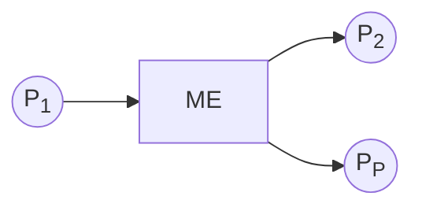

# Introduzione al trasformatore elettrico  

  

Il trasformatore e' una **macchina elettrica** che appunto trasforma l'energia elettrica cambiandone i parametri di tensione e corrente. E' composto da un nucleo ferromagnetico su cui vi sono un avvolgimento primario ed uno secondario. Si dice macchina elettrica un dispositivo in grado di trasformare energia sfruttando le leggi dell'elettromagnetismo, in particolare:  

* legge di *Faraday-Neumann-Lenz*
* legge di *azione elttrodinamica*

La prima ci dice che la variazione di flusso magnetico nel tempo produce una tensione indotta. La seconda ci dice che un conduttore percorso da corrente immerso in un campo magnetico e' soggetto ad una forza.  

## Rendimento  

$\eta = \dfrac{P_2}{P_1}$  

Il trasformatore, come ogni macchina elettrica, ha un rendimento $\eta$ definito come il rapporto tra potenza in uscita e quella in entrata. Rispetto alle macchina rotanti e.g. un motore, il trasformatore, essendo una **macchina statica**, ha un rendimento maggiore in quanto non ci sono perdite per *effetto Joule* dovute al movimento di parti meccaniche.  

E' importante notare che il sistema ha sempre delle perdite $P_P$ per cui possiamo riscrivere l'equazione come...  

$\eta = \dfrac{P_2}{P_1} = \dfrac{P_1-P_P}{P_1} = 1 - \dfrac{P_P}{P_1}$  

Il trasformatore e' soggetto a due perdite principali:  

* perdite per *effetto Joule* $P_j$
* perdite per *perdite del ferro* $P_f$

## Perdite Joule  

$P_j = RI^2$  

La perdita per effetto Joule e' dovuta al tipo di materiale dei conduttori con cui viene realizzato il trasformatore e.g. rame, alluminio. Questa dipende quindi dalla resistenza $R$ del materiale.  

## Perdite del ferro  

$P_f = P_i + P_{cp}$  

Le perdite del ferro $P_f$ hanno a che fare con il nucleo magnetico, e hanno due componenti:
* perdite per *isteresi* $P_i$
* perdite per *correnti parassite* $P_{cp}$

Le **perdite per isteresi** si hanno in quanto parte dell'ernergia deve essere spesa per orientare i domini magnetici in direzione del flusso.  

$P_i = K_i \cdot f \cdot B_M^n$  

Dove $K_i$ tiene conto del materiale del nucleo, $f$ e' la frequenza, mentre $B_M$ e' l'induzione massima.  

Le **perdite per correnti parassite** sono dovute al flusso magnetico, che attraversando il nucleo ferromagnetico, quindi conduttore, vi causa delle correnti indesiderate dette *parassite* determinando una dissipazione di energia per effetto Joule.  

$P_{cp} = K_{cp} \cdot f^2 \cdot B_M^2$  

Dove $K_{cp}$ tiene conto del materiale del nucleo, $f$ e' la frequenza, mentre $B_M$ e' l'induzione massima.  

  

Uno dei modi per minimizzare queste correnti indesiderate e' quello di ridurre la sezione del conduttore. Per la seconda legge di Ohm si ha che una sezione minore da luogo ad una resistenza maggiore e di conseguenza ad una corrente minore.  

Per fare cio' si i nuclei ferromagnetici, anziche' essere composti da un singolo blocco, vengono assemblati da $n$ lamierini a bassa conducibilita' isolati tra loro.  

In pratica pero' vedremo che i produttori forniscono un unico valore detto **cifra di perdita** $P_{fs} [W/kg]$ che tiene conto delle perdite da isteresi e correnti parassite.  