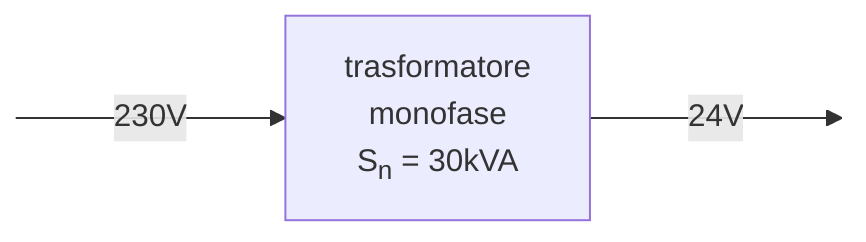

# Perdite nel ferro alla tensione nominale  

I dati di targa del trasformatore forniscono la potenza apparente, in questo caso $S_n = 30\ kVA$, e le tensioni del quadripolo, $230\ V$ sul primario e $24\ V$ sul secondario. Le rispettive correnti nominali saranno allora:  

$I_{1n} = \dfrac{S_n}{V_{1n}} = \dfrac{30 \cdot 10^3}{230} \simeq 130.43\ A$  

$I_{2n} = \dfrac{S_n}{V_{2n}} = \dfrac{30 \cdot 10^3}{24} \simeq 1250\ A$  

I dati di targa dovrebbero fornire anche le perdite nel ferro percentuali $P_{0_{pc}} = 3$ alla tensione nominale, con cui e' possibile ricavare la potenza persa in *watt*.  

$P_0 = \dfrac{S_n \cdot P_{0_{pc}}}{100} = \dfrac{30\ 000 \cdot 3}{100} = 900\ W$  

Quando la tensione in ingresso e' uguale alla tensione nominale $V_1 = V_{1n}$ le perdite nel ferro sono uguali a $P_0$  

$P_f = P_0$  

Se invece $V_1 \ne V_{1n}$ allora...  

$P_f = P_0 \cdot \bigg(\dfrac{V_1}{V_{1n}}\bigg)^2$  

Assumendo una caduta di tensione percentuale sul cavo $\Delta V_{pc} = 4$ si avrebbe una caduta di $\Delta V = 9.2\ V$ per cui in ingresso non si ha piu' la tensione nominale ma...  

$V_1 = V_{1n} - \Delta V = 230 - 9.2 = 220.8\ V$  

Per il rapporto spire $K_N \simeq \dfrac{V_{1n}}{V_{2n}} = \dfrac{230}{24} \simeq 9.58$ ne segue allora che...  

$V_{2} = V_1 \cdot \dfrac{1}{K_N} = 220.8 \cdot \dfrac{24}{230} = 23.04$  

Si ha infine che le perdite nel ferro sono...  

$P_f = P_0 \cdot \bigg(\dfrac{V_1}{V_{1n}}\bigg)^2 = 900 \cdot \bigg(\dfrac{220.8}{230}\bigg)^2 = 829.44\ W$  
