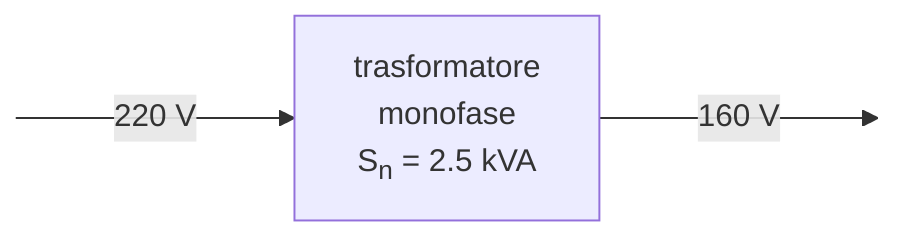

# Trasformatore in cortocircuito  

Si vuole misurare tensione, corrente e potenza del trasformatore aumentando la tensione fino ad ottenere il valore di corrente nominale.  

$I_{1n} = \dfrac{S_n}{V_{in}} = \dfrac{2500}{220} \simeq 11.364\ A$  

| $V_{in}[V]$ | $I_1[A]$ | $P[W]$ |
| ----------- | -------- | ------ |
| 2.0         | 2.1      | 4.0    |
| 4.0         | 5.6      | 20.6   |
| 5.5         | 7.9      | 40     |
| 6.5         | 7.2      | 54     |
| 7.9         | 11.3     | 81     |

<iframe src="https://www.desmos.com/calculator/d4qwbzgeoy?embed" width="400" height="400" style="border: 1px solid #ccc" frameborder=0></iframe>
