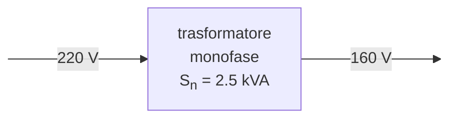

# Trasformatore in cortocircuito  



Si vuole eseguire la **prova in cortocircuito** di un trasformatore. Questa consiste nel misurare tensione, corrente e potenza assorbita dal trasformatore aumentando la tensione fino ad ottenere il valore di **corrente nominale**.  

Considerando che in cortocircuito la tensione di alimentazione e' estremamente ridotta, le perdite nel ferro diventano trascurabili, per cui la potenza assorbita dal trasformatore in cortocircuito $P_{cc}$ equivale alle **perdite nel rame in condizioni nominali**.  

$P_{cc} \simeq P_{cu} = R_1I_{1n}^2 +R_2I_{2n}^2$  

## Dati di targa  

Il trasformatore in esame ha le seguenti caratteristiche:  

$S_n = 2.5\ kWA$  

$V_{1n} = 220\ V$  
$V_{2n} = 160\ V$  

## Corrente nominale  

Si sceglie di effettuare la prova sul circuito primario per cui si utilizzano i dati di targa per derivare il rapporto di trasformazione e la corrente nominale necessaria per la prova.  

$K_0 = \dfrac{V_{1n}}{V_{2n}} = \dfrac{220}{160} = 1.375$  

$I_{1n} = \dfrac{S_n}{V_{1n}} = \dfrac{2500}{220} \simeq 11.36\ A$  

## Prova in laboratorio  
  

  

  

Una volta collegati gli strumenti come in figura si procede ad aumentare la tensione in ingresso $V_{1cc}$ partendo da zero fino ad ottenere la corrente nominale $I_{1n}$  

| $V_{1cc}[V]$ | $I_{1cc}[A]$ | $P_w[W]$ |
| ------------ | ------------ | -------- |
| $2.0$        | $2.1$        | $4.0$    |
| $4.0$        | $5.6$        | $20.6$   |
| $5.5$        | $7.9$        | $40$     |
| $6.5$        | $7.2$        | $54$     |
| $7.9$        | $11.3$       | $81$     |

Gli strumenti a disposizione ci permettono di misurare $I_{1cc} = 11.3\ A \simeq I_{1n}$  

  
   

## Potenza al netto degli autoconsumi  

Data la resistenza molto piccola si considera l'amperometro come un cortocircuito, analogamente il voltmetro configurato su $15\ V$ di fondo scala presenta $R_v = 100\ \Omega$ di resistenza risultando in una piccola corrente trascurabile.  

$I_v = \dfrac{V_{1cc}}{R_v} = \dfrac{7.9}{100} = 0.079\ A$  

Utilizziamo quindi la formula per il calcolo della potenza al netto degli autoconsumi, dove $R_v$ e' la resistenza del voltmetro, mentre $R_w$ quella del wattmetro, che nella nostra configurazione presenta $R_w = 1465\ \Omega$  

$P_{cc} = P_w - \dfrac{V_{1cc}^2}{R_v} - \dfrac{V_{1cc}^2}{R_w} = 81 - \dfrac{7.9^2}{100} - \dfrac{7.9^2}{1465} \simeq 80.33\ W$  

Ne segue che queste rappresentano le perdite nel rame in condizioni nominali.  

$P_{cc} \simeq P_{cu} \simeq 80.33\ W$  

Eventualmente si ricavano i valori percentuali della potenza e della tensione in cortocircuito.  

```math
P_{ccn\%} = \dfrac{P_{cc}\cdot 100}{S_n} =\dfrac{80.33 \cdot 100}{2500} \simeq 3.21\ \%
```

```math
V_{1ccn\%} = \dfrac{V_{1cc}\cdot 100}{V_{1n}} = \dfrac{7.9\cdot 100}{220} \simeq 3.59\ \%
```  

## Parametri longitudinali  

Dalla potenza e' possible derivare i paramentri longitudinali sul lato alimentato tenendo conto che $I_{1cc} \simeq I_{1n}$  

$\cos \varphi = \dfrac{P_{cc}}{V_{1cc}I_{1cc}} = \dfrac{80.33}{7.9 \cdot 11.3} \simeq 0.9$  

$\varphi \simeq 25.84^\circ$  

$R_{1cc} = \dfrac{P_{cc}}{I_{1cc}^2} = \dfrac{80.33}{11.3^2} \simeq 0.63\ \Omega$  

$X_{1cc} = R_{1cc} \cdot \tan \varphi = 0.63 \cdot 0.48 \simeq 0.3\ \Omega$  

Per trovare i parametri sul secondario e' necessario derivare $I_{2cc} \simeq I_{2n}$  

$I_{2cc} = I_{1cc} \cdot K_0 = 11.3 \cdot 1.375 = 15.55\ A$  

$R_{2cc} = \dfrac{P_{cc}}{I_{2cc}^2} = \dfrac{80.33}{15.55^2} \simeq 0.33\ \Omega$  

$X_{2cc} = R_{2cc} \cdot \tan \varphi = 0.33 \cdot 0.48 \simeq 0.16\ \Omega$  
