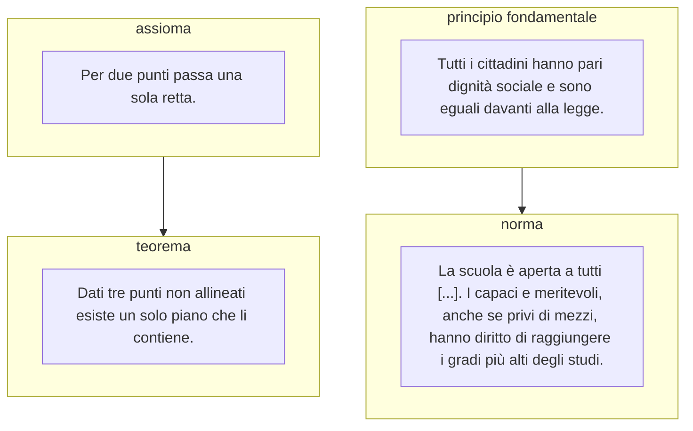

# Tutti i numeri della costituzione  

Leggendo l'estratto del libro dal titolo *"Relazioni"* non ho potuto far altro che notare l'assenza di quella che io credo sia una delle relazioni fondamentali tra matematica e costituzione: i **sistemi assiomatici**.   

# Sistemi assiomatici  

Un sistema assiomatico e' un insieme di proposizioni non dimostrabili, dette appunto assiomi, che possono essere utilizzate per derivare teoremi, ovvero applicare le regole per ottenere configurazioni del sistema che non sarebbero altrimenti ovvie. 

Il gioco degli scacchi ad esempio e' un sistema assiomatico, seguendone le regole si ottengono nuovi stati (teoremi) della scacchiera. E' importante notare pero' che i teoremi del gioco degli scacchi non ci dicono nulla sul mondo reale. 

L'esistenza di una relazione tra il mondo astratto della matematica ed il mondo fisico invece, permette, grazie a ragionevoli assiomi di partenza, di derivare verita' sul mondo fisico semplicemente manipolando i simboli del sistema rispettandone le regole.  

# Costituzione come sistema assiomatico  

Da un certo punto di vista potremmo dire che i principi fondamentali della costituzione svolgono il ruolo degli **assiomi**, verita' di partenza che si accettano per definizione, mentre le norme costituzionali o le leggi ordinare rappresentano quindi **teoremi**, regole che vengono sviluppate (o derivate ;)) proprio dai principi fondamentali grazie a **regole di inferenza** e.g. procedure logiche o giuridiche. Per semplicita' utilizzo uno degli assiomi della geometria euclidea per evidenziare la relazione tra questi due sistemi apparentemente lontani tra loro...  

Mentre la matematica utilizza un liguaggio formale, la costituzione utilizza un linguaggio naturale che presenta sfumature e ambiguita' ed e' per questo soggesto ad interpretazioni. Resta il fatto che come nella matematica non deve essere possibile creare una norma che vada in conflitto con i principi fondamentali, questo porterebbe ad una contraddizione rendendo il sistema inconsistente.  
