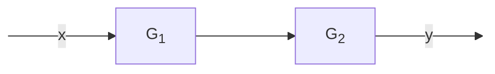

# Sistemi nel dominio di Laplace  

Dati due circuiti e' possibile ricavarne le rispettive funzioni di trasferimento $G_1(s)$ e $G_2(s)$. Se collegati in serie e' possibile ricavare la funzione di trasferimento $G_{tot}(s)$ del nuovo sistema semplicemente applicando la formula dei sistemi in serie, ovvero $G_{tot}(s) = G_1(s)\cdot G_2(s)$  

## Circuito RC  

  

In questo circuito RC si ha:
* $R = 0.5\ k\Omega$  
* $C = 0.4\ mF$  

Applicando il partitore di tensione...  

$V_{out}(s) = \dfrac{\dfrac{1}{Cs}}{R+\dfrac{1}{Cs}}\cdot V_{in}(s) = \dfrac{1}{\cancel{Cs}}\cdot\dfrac{\cancel{Cs}}{RCs+1}\cdot V_{in}(s) = \dfrac{1}{RCs+1}\cdot V_{in}(s)$  

La costante di tempo e' proprio $RC$...  

$\tau = RC = 0.5\cdot 10^3 \cdot 0.4 \cdot 10^{-3} = 0.2\ s$  

Ne segue che...  

$G_1(s) = \dfrac{1}{RCs+1} = \dfrac{1}{0.2s+1} = \dfrac{1}{0.2(s+5)} = 5\cdot\dfrac{1}{s+5}$  

$g_1(t) = 5e^{-5t}u(t)$  

## Partitore di tensione  

  

Questo partitore di tensione e' composto da:  
* $R_1 = 3\ M\Omega$
* $R_2 = 2\ M\Omega$  

Applicando di nuovo il partitore...  

$V_{out}(s) = \dfrac{R_2}{R_1+R_2}\cdot V_{in}(s) = \dfrac{2\cdot \cancel{10^6}}{\cancel{10^6}(3 + 2)}\cdot V_{in}(s) = \dfrac{2}{5}\cdot V_{in}(s)$  

$G_2 = \dfrac{2}{5}$  

## Funzione di trasferimento del sistema  

Collegati in serie e' possible calcolare la funzione di trasferimento con:  

$G_{tot}(s) = G_1(s)\cdot G_2(s) = \cancel{5}\cdot\dfrac{1}{s+5}\cdot \dfrac{2}{\cancel{5}} = \dfrac{2}{s+5}$  

$g_{tot}(t) = 2e^{-5t}u(t)$  
