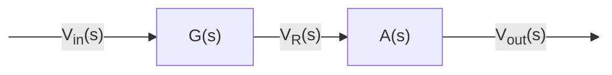

# Ingegneria inversa della funzione di trasferimento  

vogliamo farci un'idea quale potrebbe essere un circuito in grado di produrre la seguente funzione di trasferimento:  

$F(s) = \dfrac{102s}{s^2+31s+168}$  

Usiamo il trinomio particolare al denominatore per trovare le radici:   

$$
\begin{cases}
  \begin{aligned}
    p\cdot m &= 168\\
    p+m &= 31
  \end{aligned}
\end{cases}
\begin{cases}
  \begin{aligned}
    p = 24\\
    m = 7
  \end{aligned}
\end{cases}
$$

$x_1 = -24$  
$x_2 = -7$  

Possiamo allora riscrivere...  

$F(s) = \dfrac{102s}{(s+24)(s+7)} = \dfrac{A}{s+24} + \dfrac{B}{s+7}$  

$A = \bigg[F(s)\cdot (s+24)\bigg]_{s=-24} = 144$  

$B = \bigg[F(s)\cdot (s+7)\bigg]_{s=-7} = -42$  

$F(s) = \dfrac{144}{s+24} - \dfrac{42}{s+7}$  

Tornando nel dominio del tempo troviamo che...  

```math
f(t) = \underbrace{144e^{-24t}u(t)}_{\text{transitorio 1}}\ \underbrace{-42 e^{-7t}u(t)}_{\text{transitorio 2}}
```

In questa funzione si notano due transitori, questo implica che il sistema e' composto da almeno **due elementi capaci di immagazzinare energia**.  

### Circuito RLC  

  

Conosciamo solo due componenti in grado di immagazzinare energia, per cui si ipotizza un circuito di questo tipo, ovvero **RLC**.  

Sapendo che la funzione di trasferimento non e' che il partitore di tensione rispetto a $R$ 
si ha che...  

```math
Z_{tot} = Ls+\dfrac{1}{Cs}+R = \dfrac{CsLs+1+RCs}{Cs} = \dfrac{LCs^2+RCs+1}{Cs}
```

```math
G(s) = \dfrac{R}{Z_{tot}} = \dfrac{RCs}{LCs^2+RCs+1} = \dfrac{R\cancel{C}s}{L\cancel{C}\bigg(s^2+\frac{R\cancel{C}}{L\cancel{C}}s+\frac{1}{LC}\bigg)} = \dfrac{\frac{R}{L}s}{s^2+\frac{R}{L}+\frac{1}{LC}}
```

La funzione di trasferimento ottenuta e' in effetti nella stessa forma di quella di partenza...  

$F(s) = \dfrac{102s}{s^2+31s+168} \propto \dfrac{\frac{R}{L}s}{s^2+\frac{R}{L}+\frac{1}{LC}}$  

Assumendo veri i valori al denomeratore allora sara' sufficiente aggiungere un amplificatore in serie, dove $A(s) \simeq 3.29$, per ottenere la funzione di partenza.  

$\dfrac{R}{L} = 31$  

$\dfrac{1}{LC} = 168$  

$F(s) = G(s) \cdot A(s) = \dfrac{31s}{s^2+31s+168} \cdot 3.29 \simeq \dfrac{102s}{s^2+31s+168}$  


