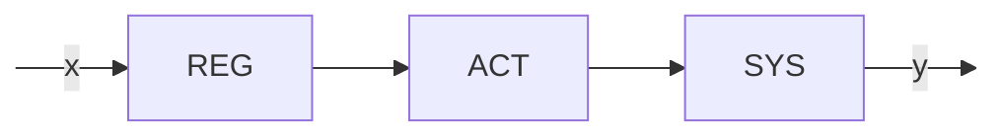
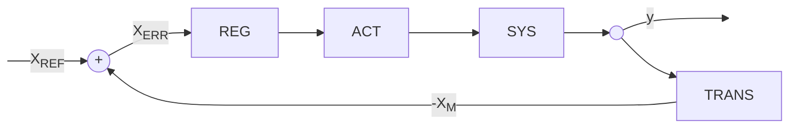
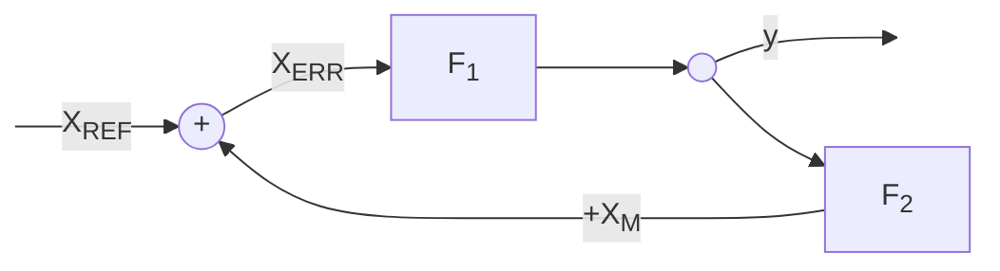

# Sistemi in retroazione  

I sistemi di controllo possono essere di due tipi:  

1. ad anello aperto
2. ad anello chiuso

## Sistemi di controllo ad anello aperto  

Un sistema di controllo ad **anello aperto** e' un sistema che accetta input e modifica il sistema da controllare senza tenere conto dello stato del sistema.  

In questo tipo di sistemi in dipendenza di un certo input $x$ il regolatore **REG** aziona l'attuatore **ACT** che a sua volta modifica una certa caratteristica $y$ del sistema da controllare **SYS**.  

## Sistemi di controllo ad anello aperto  

$X_{ERR} = X_{REF} - X_M$  

Nei sistemi ad anello chiuso il regolatore riceve in ingresso il segnale di errore $X_{ERR}$, ovvero la differenza tra il segnale di riferimento $X_{REF}$ e il segnale misurato $X_{M}$. Questo permette al sistema di controllo di modificare l'uscita del sistema quanto basta per portarla al segnale desiderato $X_{REF}$ grazie ad un feedback loop in cui il sistema si autoregola.  

## Retroazione posisitiva  

Quando il segnale misurato viene sommato al segnale di riferimento allora si parla di **retroazione positiva**.  

La funzione di trasferimento in questo tipo di sistemi e'...  

$F_{RP} = \dfrac{F_1}{1-F_1F_2}$  

## Retroazione negativa  

Quando il segnale misurato viene sottratto al segnale di riferimento allora si parla di **retroazione negativa**.  

La funzione di trasferimento in questo tipo di sistemi e'...  

$F_{RP} = \dfrac{F_1}{1+F_1F_2}$  

## Stabilita' di un sistema  

Date le funzioni di trasferimento $F_1(s) = \dfrac{1}{s+10}$ ed $F_2(s) = 40$ si vuole esaminare la stabilita' del sistema in retroazione positiva e negativa. Per prima cosa troviamo la funzione in serie $F_s = F_1F_2$  

$F_s(s) = F_1(s)F_2(s) = \dfrac{1}{s+10} \cdot 40 = \dfrac{40}{s+10}$  

Per cui la funzione di trasferimento in retroazione negativa sara'...  

$F_{RN}(s) = \dfrac{F_1(s)}{1+F_s(s)} = \dfrac{1}{s+10}\cdot\dfrac{1}{1+\frac{40}{s+10}} = \dfrac{1}{\cancel{s+10}}\cdot\dfrac{\cancel{s+10}}{s+50} = \dfrac{1}{s+50}$  

La funzione di trasferimento in retroazione positiva sara'...  

$F_{RP}(s) = \dfrac{F_1(s)}{1-F_s(s)} = \dfrac{1}{s+10}\cdot\dfrac{1}{1-\frac{40}{s+10}} = \dfrac{1}{\cancel{s+10}}\cdot\dfrac{\cancel{s+10}}{s-30} = \dfrac{1}{s-30}$  

Tornando nel dominio del tempo si ha che...  

$F_s(s) \implies f_s(t) = 40e^{-10t}u(t)$  

$F_{RN}(s) \implies f_{RN}(t) = e^{-50t}u(t)$  

$F_{RP}(s) \implies f_{RP}(t) = e^{+30t}u(t)$  

Esaminando il sistema nelle differenti configurazioni scopriamo che in retroazione $F_{RN}$ oppure $F_{RP}$ il sistema risponde piu' velocemente di quando e' collegato in serie $F_s$. L'aumento della costante $a = \dfrac{1}{\tau}$ ci suggerisce quindi che la retroazione cambia la dinamica del sistema. Inoltre e' importante notare che la retroazione positiva ha portato all'instabilita' del sistema.  
