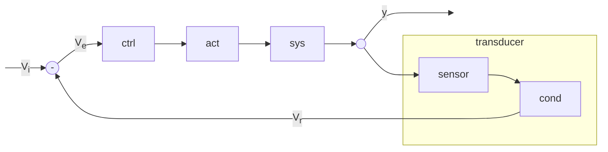

# Controllo automatico di temperatura di un forno  

1. Un potenziometro fornisce in ingresso una tensione $V_i$ che rappresenta la temperatura desiderata
2. Il blocco di reazione non e' che il trasduttore, questo converte la temperatura rilevata nel forno in una tensione $V_r$
3. il nodo sottrattore produce quindi il segnale di errore $V_e = V_i - V_r$
4. il blocco di controllo e' presente se c'e' bisogno di manipolare il segnale
5. il blocco di attuazione si occupa modificare il sistema in modo proporzionale alla tensione fornita
6. il forno e' il sistema da controllare 

### Principio di funzionamento  

Una volta fissato il valore della tensione di riferimento $V_i$ che rappresenta la temperatura desiderata, al variare della temperatura del forno variera' la tensione del blocco di reazione $V_r$ causando a sua volta una variazione nella tensione di errore $\pm V_e$  

Se la temperatura misurata e' minore di quella desiderata allora si ha un errore positivo che porta all'aumento della quantita di combustibile che a sua volta porta all'aumento della temperatura del forno.  

Per semplicita' impotizziamo l'uso di una sonda **PT1000** che ha resistenza $R_T = 1758.6\ \Omega$ ad una temperatura di $200^\circ C$. La tensione in ingresso $V_i$ che rappresenta la temperatura desiderata sara' allora:  

$V_i = E \cdot \dfrac{R_T}{R_T+R_0} = 12\cdot\dfrac{1758.6}{1758.6+1000} \simeq 7.65\ V$  

Se la temperatura misurata dal sensore e' $200^\circ C$ allora $V_r = V_i = 7.65\ V$ per cui...  

$V_i - V_r = V_e = 0\ V$  

Se invece la temperatura del forno scende $T_r\downarrow$ la tensione in uscita dal blocco di reazione $V_r\downarrow$ scende a sua volta portando ad un segnale di errore positivo che attraverso il blocco di controllo e attuazione aumentera' la temperatura del forno, compensando alla diminuzione di temperatura.  

$V_i = 7.65 \implies \sim 200^\circ C$  
$V_r = 7.12 \implies \sim 120^\circ C$  

$V_i - V_r = V_e = 7.65 - 7.12 = 0.53\ V$  
