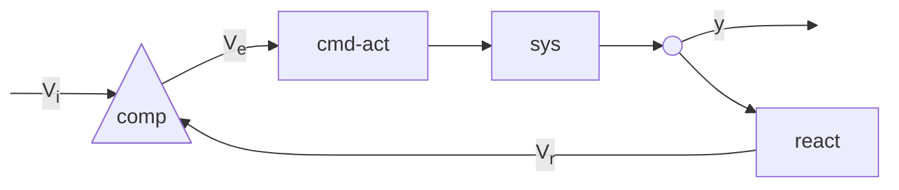

# Sistema di controllo on/off  

In un sistema di controllo on/off si ha un feedback loop in cui il sistema si accende o si spegne in dipendenza del segnale rilevato dal blocco di reazione. Ipotizzando un sistema in cui si vuole controllare la temperatura, il blocco di reazione, costituito dal trasduttore, si occupa della conversione di una grandezza fisica, in questo caso la temperatura, in un segnale elettrico, spesso la tensione $V_r$.  

Questa viene portata al comparatore che confrontandola con la tensione in ingresso $V_i$ decide se dare o meno tensione al regolatore. Assumendo un comparatore alimentato a $12\ V$...  

$V_i \gt V_r \implies V_e = 12\ V$  

Se $V_r$ varia al variare della temperatura, allora sara' possibile scegliere valori arbitrari di $V_i$ per aumentare o diminuire la soglia alla quale il sistema si accende.  
