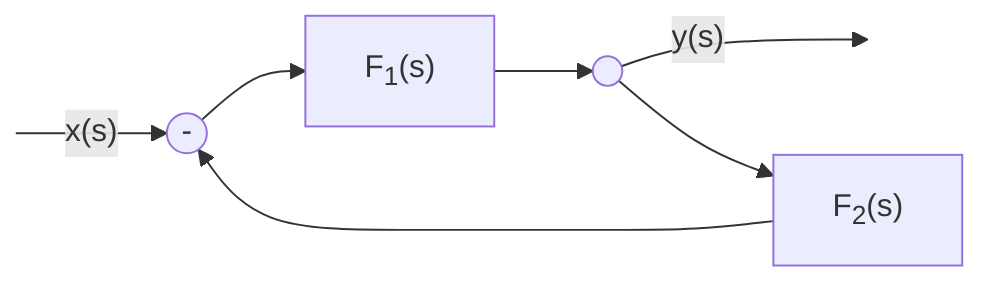
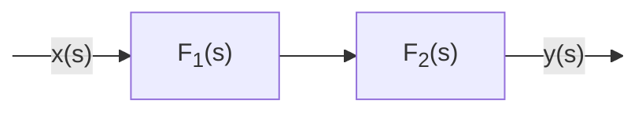

# Criterio di Bode  

Il criterio di stabilita' di Bode ci dice che un sistema ad anello aperto e' stabile se lo sfasamento calcolato alla pulsazione di taglio e' minore di $180^\circ$. Se la condizione e' soddisfatta allora e' stabile anche per lo stesso sistema collegato ad anello chiuso.  

Dato il sistema ad anello chiuso si vuole verificarne la stabilita' considerato che:  

$F_1(s) = \dfrac{1}{1+\dfrac{s}{10}}$  

$F_2(s) = 10$  

Essendo in retroazione negativa...  

$G(s) = \dfrac{F_1(s)}{1+F_1(s)\cdot F_2(s)} = \dfrac{\dfrac{1}{1+\dfrac{s}{10}}}{1+\dfrac{1}{1+\dfrac{s}{10}}\cdot 10} = \dfrac{10}{s+110}$  

Il polo e' negativo $s_p = -110$ percio' il sistema e' stabile. Vogliamo ora applicare il *criterio di Bode*, quindi ricaviamo i diagrammi di Bode per lo stesso sistema, ma questa volta collegato ad **anello aperto**.  

Con il sistema ad anello aperto si ha che...  

$G(s) = F_1(s)\cdot F_2(s) = \dfrac{1}{1+\dfrac{s}{10}}\cdot 10$  

Ma allora sappiamo anche che...  

$|G|_{db} = |F_1|_{db}+|F_2|_{db}$  

Dove gli andamenti di $|F_1|_{db}$ ed $|F_2|_{db}$ sono ormai noti.  

  

Ricaviamo quindi il grafico della fase di $G$ ricordando che nel prodotto di numeri complessi la fase e' data da...  

$\angle G = \angle F_1 + \angle F_2$  

Dove l'andamento di $\angle F_1$ e' ormai noto, cosi' come $\angle F_2 = 0^\circ$  

  

Il criterio di stabilita' di Bode ci dice allora che il sistema e' stabile, in quanto lo sfasamento tra ingresso ed uscita alla pulsazione di taglio e' minore di $180^\circ$ confermando il risultato ottenuto nel sistema collegato ad anello chiuso.  
