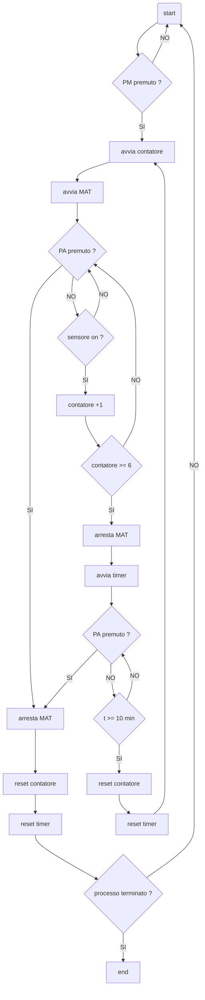

# Mini prova esame  

Un nastro trasportatore conduce delle bottiglie in plastica verso le scatole dove devono essere imballate. Una fotocellula rileva il passaggio delle bottiglie. Quando l'operatore preme il pulsante di avvio devono passare 6 bottiglie davanti alla fotocellula. Il nastro si deve quindi arrestare per 60 secondi al fine di sostituire l'imballaggio pieno con un nuovo imballaggio vuoto. Trascorso tale tempo il nastro trasportatore riprende a muoversi e ricomincia il conteggio delle bottiglie in modo automatico.  

## Lista di attribuzione  

| componente        | simbolo | ladder ID | stato iniziale | I/O    |
| ----------------- | ------- | --------- | -------------- | ------ |
| pulsante marcia   | $P_M$   | $I_1$     | 0              | input  |
| pulsante arresto  | $P_A$   | $I_2$     | 1              | input  |
| sensore bottiglie | $S_B$   | $I_3$     | 0              | input  |
| rele termico      | $R_T$   | $I_4$     | 1              | input  |
| contattore        | $C_1$   | $Q_1$     | 0              | output |
| lampada verde     | $L_V$   | $Q_2$     | 1              | output |
| lampada rossa     | $L_R$   | $Q_3$     | 0              | output |
| lampada gialla    | $L_G$   | $Q_4$     | 0              | output |
