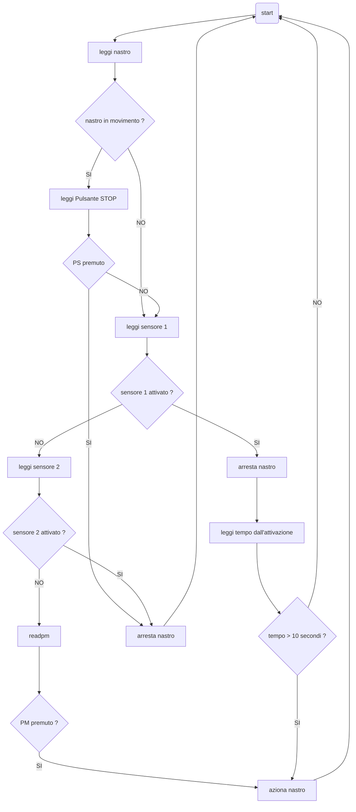

# Movimentazione oggetto su nastro trasportatore temporizzato  

Alla pressione di un pulsante di marcia avanti, il pezzo viene mosso sul nastro trasportatore da un punto **A** ad un punto **B**. Raggiunta la posizione centrale **C** il pezzo si ferma per $10\ s$ per poi ripartire automaticamente e raggiungere la posizione finale **B** dove il pezzo si ferma definitivamente in attesa di essere tolto dal nastro. Sono previsti:  

* un pulsante di stop/emergenza che arresta il processo in qualunque momento
* un sensore di sovraccarico
* un sistema di segnalazione che indichi lo stato del processo

