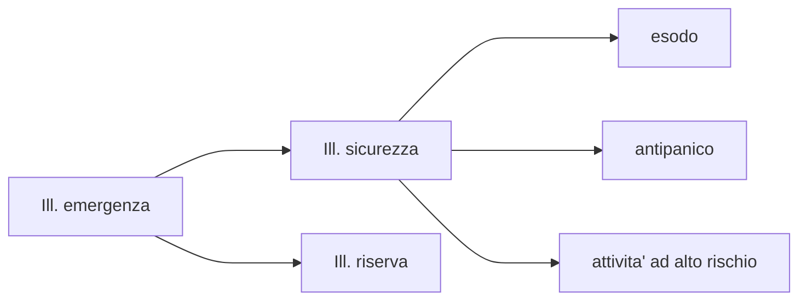

# Illuminazione di emergenza  

In mancanza di illuminazione ordinaria e' necessario fornire illuminazione di riserva per due motivi principali:  

* sicurezza delle persone (illuminazione di sicurezza)
* continuazione dell'attivita' (illuminazione di riserva)

Un gruppo elettrogeno impiega circa 15 secondi per avviarsi, ne segue che per soddisfare le tempistiche d'intervento della norma e' necessario abbinare un UPS (soccorritore). In alternativa esistono gruppi di continuita' rotanti dove grazie ad un **volano** il gruppo elettrogeno riesce ad avviarsi immediatamente, quindi senza dover abbinare un UPS.  

